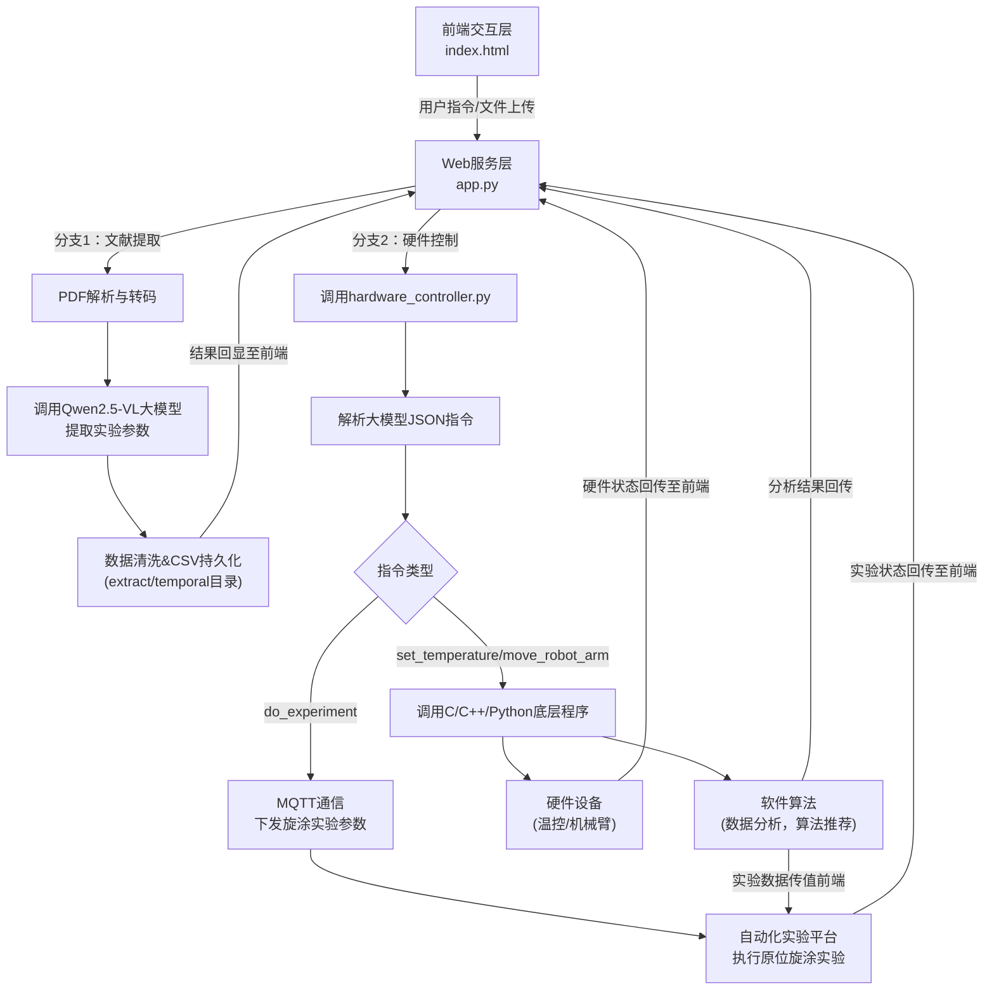
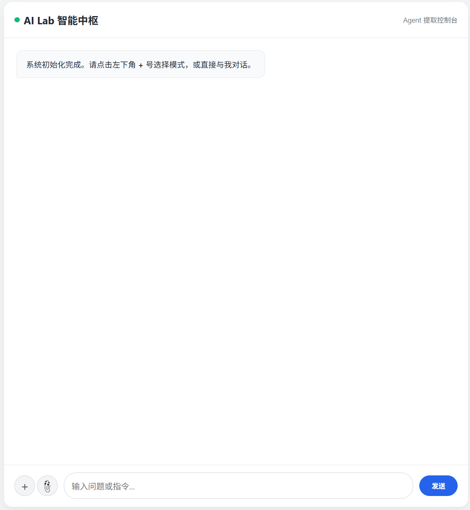
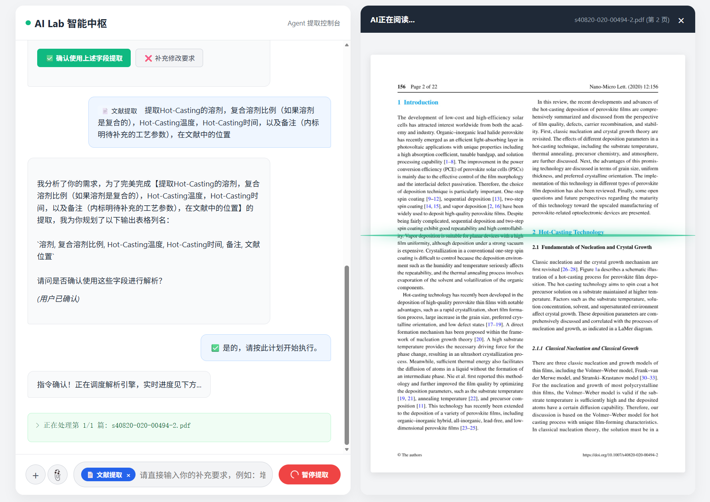

# SDL_agent：AI驱动的文献提取与硬件控制智能中枢
SDL_agent 是一套集**学术文献PDF数据智能提取**、**大模型指令解析**、**自动化硬件控制**于一体的智能代理系统，核心为“文献数据提取→实验参数解析→自动化硬件执行”的全流程闭环，适用于实验室自动化实验场景（如原位旋涂实验）。

## 一、系统整体流程
### 1. 核心流程概述


### 2. 流程拆解
#### （1）前端交互（index.html）
用户通过可视化Web界面操作，支持3种核心模式：
- 普通问答模式：基础对话交互；
- 文献提取模式：上传/选择PDF文献，输入提取任务描述（如“提取旋涂转速、试剂体积”）；
- 硬件操控模式：下发硬件控制指令（如“执行原位旋涂实验，转速3000rpm”）。
界面支持PDF预览、提取进度实时展示、任务中断、结果可视化等能力。

#### （2）文献数据提取（app.py 核心）
1. **PDF预处理**：将PDF指定页码转为高分辨率Base64图片，供大模型视觉输入；
2. **动态字段生成**：根据用户提取任务描述，调用Qwen2.5-72B大模型生成CSV表格列名（如“反溶剂名称”“旋涂转速”）；
3. **大模型提取**：调用Qwen2.5-VL-72B-Instruct多模态模型，从PDF图片中提取目标实验参数；
4. **数据持久化**：将提取结果写入CSV文件（分归档文件`extract/前缀_时间戳.csv`和临时文件`temporal/extraction.csv`，后者供硬件控制模块调用）；
5. **进度回显**：实时向前端推送处理进度、提取结果、错误信息，支持任务手动中断。

#### （3）硬件控制（hardware_controller.py 核心）
1. **指令解析**：接收大模型输出的JSON格式指令，清洗并解析`action`（操作类型）和`params`（参数）；
2. **路由分发**：
   - `do_experiment`：解析旋涂实验参数（转速、加速度、时长、试剂、体积），读取试剂位置配置文件，通过MQTT协议（EMQX服务器，IP：192.168.120.129:1883）向自动化平台下发实验指令；
   - `set_temperature`：调用C/C++可执行文件控制温控设备；
   - `move_robot_arm`：调用Python脚本控制机械臂；
3. **通信保障**：MQTT连接带超时机制，断连自动重连，确保指令可靠下发。

## 二、核心文件说明
| 文件路径 | 核心角色 | 关键能力 |
|----------|----------|----------|
| `templates/index.html` | 前端可视化界面 | 多模式交互、PDF预览、进度展示、任务控制 |
| `app.py` | Flask Web服务主程序 | PDF转码、大模型调用、数据提取/持久化、任务调度、硬件模块集成 |
| `hardware_controller.py` | 硬件控制核心模块 |试剂位置解析、实验指令整合、大模型指令路由、底层硬件调用 |
| `agent_client.py` | EMQX服务器连接模块 | MQTT通信、实验指令下发 |
| `temporal/extraction.csv` | 临时数据文件 | 存储最新提取的实验参数，供硬件控制模块调用 |
| `extract/` | 归档数据目录 | 按时间戳存储历史提取结果，支持追溯 |
| `reagent_layout.json` | 试剂配置文件 | 存储自动化平台上试剂的物理位置（BPxx格式） |

## 三、环境配置

### 1. 配置虚拟环境

```bash
conda create -n SDL_agent python=3.10 -y
conda activate SDL_agent
```

### 2. 依赖安装
```bash
pip install -r requirements.txt
# flask==2.3.3
# pymupdf==1.23.22
# pillow==10.1.0
# requests==2.31.0
# paho-mqtt==1.6.1
# python-dotenv==1.0.0
```

### 3. 关键配置项
修改`app.py`中以下配置适配本地环境：
```python
# 大模型API配置
SILICONFLOW_API_KEY = "你的SiliconFlow API密钥"
MODEL_NAME = "Qwen/Qwen2.5-VL-72B-Instruct"
API_URL = "https://api.siliconflow.cn/v1/chat/completions"

# PDF存储目录
PDF_FOLDER = r"本地PDF文件夹路径"

# MQTT服务器配置（hardware_controller.py）
class Client_Conf:
    def __init__(self):
        self.client_id = "自定义客户端ID"
        self.usr_name = "MQTT账号"
        self.password = "MQTT密码"
        self.ip = "MQTT服务器IP"
        self.port = 1883
```

## 四、快速启动
1. 配置好API密钥、PDF目录、MQTT服务器信息；
2. 启动Flask服务：
   ```bash
   python app.py
   ```
3. 浏览器访问`http://127.0.0.1:5000`，进入“AI Lab 智能中枢”界面；
4. 选择模式使用：
   - **文献提取**：点击回形针上传PDF，输入提取任务（如“提取所有原位旋涂实验的转速、试剂体积”），点击发送开始提取；
   - **硬件控制**：输入硬件控制指令（JSON格式），下发至自动化实验平台。

## 五、界面预览

<div align="center">
  
  <br>
  <p><i>图: 初始界面</i></p>
</div>


<div align="center">
  
  <br>
  <p><i>图: 准备提取目标页面</i></p>
</div>


<div align="center">
  
  <br>
  <p><i>图: 提取中的页面</i></p>
</div>

### 界面效果说明

- 左侧/顶部：系统状态与模式切换区；
- 中间：对话/提取结果展示区，支持实验参数提取结果卡片化展示；
- 底部：输入区，支持文件上传、模式选择、指令输入；
- 分屏模式：可展开PDF预览面板，实时查看AI正在处理的文献页面。

## 六、核心特性
1. **多模态数据提取**：基于Qwen2.5-VL大模型，从PDF图片中精准提取结构化实验参数；
2. **动态字段适配**：根据用户任务描述自动生成CSV列名，无需固定模板；
3. **硬件控制闭环**：提取的实验参数可直接驱动自动化实验平台执行原位旋涂实验；
4. **可视化交互**：全流程Web界面操作，支持PDF预览、进度实时展示、任务中断；
5. **数据持久化**：提取结果分归档/临时文件存储，方便追溯与硬件模块调用；
6. **高可靠性**：MQTT通信带超时重连，任务支持手动中断，异常自动捕获。

## 七、注意事项
1. 确保MQTT服务器（EMQX）正常运行，自动化实验平台已接入对应Topic；
2. 大模型API调用需保证网络畅通，且API密钥有足够配额；
3. 硬件控制的C/C++可执行文件/Python脚本需放在项目根目录，确保路径正确；
4. 试剂位置配置文件`reagent_layout.json`需与自动化实验平台的试剂摆放一致；
5. 建议在Python 3.8+环境下运行，避免依赖兼容问题。
