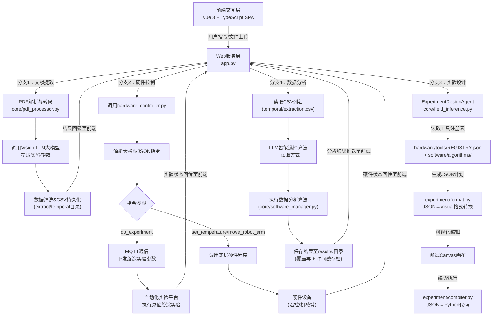

# SDL_agent：AI驱动的实验室自动化智能中枢

<div align="center">
  
  
  
</div>
<br>

SDL_agent 是一套集**学术文献PDF数据智能提取**、**AI算法自动生成**、**实验设计规划**、**自动化硬件控制**于一体的智能代理系统，实现"文献数据提取→AI生成算法→实验设计→自动化硬件执行→数据分析"的全流程闭环，适用于材料科学、化学等领域的实验室自动化场景。

<div align="center">
  
  <br>
  <p><i>图: 流程图</i></p>
</div>

---

## 一、系统整体流程

### 1. 核心流程概述


```mermaid
flowchart TD
    A["前端交互层<br/>Vue 3 + TypeScript SPA"] -->|用户指令/文件上传| B["Web服务层<br/>app.py"]

    %% 文献提取分支
    B -->|分支1：文献提取| C["PDF解析与转码<br/>core/pdf_processor.py"]
    C --> D["调用Vision-LLM大模型<br/>提取实验参数"]
    D --> E["数据清洗&CSV持久化<br/>(extract/temporal目录)"]
    E -->|结果回显至前端| B

    %% 硬件控制分支
    B -->|分支2：硬件控制| F["调用hardware_controller.py"]
    F --> G["解析大模型JSON指令"]
    G --> H{"指令类型"}

    %% 指令类型分支
    H -->|do_experiment| I["MQTT通信<br/>下发旋涂实验参数"]
    I --> K["自动化实验平台<br/>执行原位旋涂实验"]
    K -->|实验状态回传至前端| B

    H -->|set_temperature/move_robot_arm| J["调用底层硬件程序"]
    J --> L["硬件设备<br/>(温控/机械臂)"]
    L -->|硬件状态回传至前端| B

    %% 实验设计分支
    B -->|分支3：实验设计| M["ExperimentDesignAgent<br/>core/field_inference.py"]
    M -->|读取工具注册表| N["hardware/tools/REGISTRY.json<br/>+ software/algorithms/"]
    N -->|生成JSON计划| O["experiment/format.py<br/>JSON↔Visual格式转换"]
    O -->|可视化编辑| P["前端Canvas画布"]
    P -->|编译执行| Q["experiment/compiler.py<br/>JSON→Python代码"]

    %% 数据分析分支
    B -->|分支4：数据分析| R["读取CSV列名<br/>(temporal/extraction.csv)"]
    R --> S["LLM智能选择算法<br/>+ 读取方式"]
    S --> T["执行数据分析算法<br/>(core/software_manager.py)"]
    T --> U["保存结果至results/目录<br/>(覆盖写 + 时间戳存档)"]
    U -->|分析结果推送至前端| B
```

### 2. 流程拆解

#### （1）前端交互（Vue 3 + TypeScript SPA）

用户通过可视化Web界面操作，支持**5种核心模式**：

- **普通问答模式**：基础对话交互，支持流式输出与中断生成；
- **文献提取模式**：上传/选择PDF文献，输入提取任务描述（如"提取旋涂转速、试剂体积"），支持任务中断；
- **硬件操控模式**：下发硬件控制指令（如"执行原位旋涂实验，转速3000rpm"），执行期间不可中断；
- **实验设计模式**：AI自主生成实验流程JSON，前端Canvas画布支持可视化编辑、JSON/Python代码切换查看、编译执行；
- **数据分析模式**：LLM智能选择算法并执行分析，结果可视化展示。

界面支持PDF预览、算法面板、实验设计画布、进度实时展示、任务中断等能力。前端基于 Vue 3 + TypeScript + Vite 构建，采用 Pinia 状态管理和 Vue Router 路由，组件按功能域拆分（chat/experiment/extraction/hardware/analysis/search）。


<div align="center">
  
  <br>
  <p><i>图: 准备提取目标页面</i></p>
</div>

#### （2）文献数据提取

1. **PDF预处理**：将PDF指定页码转为高分辨率Base64图片，供大模型视觉输入；
2. **动态字段生成**：根据用户提取任务描述，调用大模型生成CSV表格列名（如"反溶剂名称""旋涂转速"）；
3. **大模型提取**：调用多模态模型，从PDF图片中提取目标实验参数；
4. **会话管理**：每次启动app.py创建时间戳会话文件夹`dialogue data/YYYYMMDD_HHMMSS/`，所有数据归档到会话目录；
5. **数据持久化**：提取结果写入`{session}/extract/前缀_时间戳.csv`（归档）和`{session}/temporal/extraction.csv`（临时文件）；
6. **进度回显**：实时向前端推送处理进度、提取结果、错误信息，支持任务手动中断。

<div align="center">
  
  <br>
  <p><i>图: 准备提取目标页面</i></p>
</div>


#### （3）硬件控制

1. **指令解析**：接收大模型输出的JSON格式指令，清洗并解析`type`/`name`（操作类型）和`params`（参数）；
2. **路由分发**：
   - `do_experiment`：解析旋涂实验参数（转速、加速度、时长、试剂、体积），读取试剂位置配置文件，通过MQTT协议（EMQX服务器）向自动化平台下发实验指令；
   - `set_temperature`：调用底层程序控制温控设备；
   - `move_robot_arm`：调用Python脚本控制机械臂；
3. **通信保障**：MQTT连接带超时机制，断连自动重连，确保指令可靠下发；
4. **工具注册表**：硬件工具定义在 `hardware/tools/REGISTRY.json` 中，实现函数在 `hardware/tools/{tool_name}.py` 中，通过 `platform_init/update_registry.py` 自动扫描同步。

#### （4）实验设计智能体

**设计阶段**（基于 `core/field_inference.py:ExperimentDesignAgent`）：
1. **动态提示词构建**：自动加载 REGISTRY.json 硬件工具 + software/algorithms/ 软件算法 + 内置辅助操作（WAIT/LOOP/GROUP/CONDITION/END/USER_INPUT），生成~2300字符系统提示词；
2. **AI生成JSON**：用户输入"实验设计：<描述>"，LLM生成标准JSON实验计划；
3. **SSE流式推送**（v2.3）：POST `/api/experiment_chat` 支持 `{stream: true}`，通过 `parse_experiment_design_stream()` 生成器逐chunk推送LLM输出，前端实时显示生成进度（"AI正在分析实验需求→生成实验方案→解析完成"），非流式模式仍向后兼容；
4. **格式转换**：`experiment/format.py:json_to_visual()`将JSON转为前端可视化格式（节点+边）；
5. **可视化编辑**：前端Canvas画布支持拖拽节点、编辑参数、调整执行顺序；
6. **双向同步**：`visual_to_json()`将前端修改转回标准JSON格式；
7. **代码编译**：`experiment/compiler.py` 将JSON编译为Python代码，支持直接编译执行（`compile_and_run()`）。

**执行阶段**（基于 `experiment/executor.py:ExperimentExecutor`）：
1. **计划验证**：检查JSON结构、参数完整性、试剂可用性；
2. **拓扑排序**：根据节点依赖关系确定执行顺序；
3. **顺序执行**：逐步调用硬件工具（spin_coating、set_temperature等）和软件算法；
4. **进度推送**：通过SSE实时推送执行状态到前端。

**统一JSON格式**：
```json
{
  "experiment_name": "实验名称",
  "steps": [
    {"type": "tool", "name": "spin_coating", "params": {...}, "description": "..."},
    {"type": "helper", "name": "WAIT", "params": {"duration": 5000}, "description": "..."},
    {"type": "software", "name": "data_normalization", "input_file": "...", "output_file": "..."}
  ]
}
```
- `type`: "tool"（硬件操作）、"helper"（WAIT/LOOP/GROUP/CONDITION/END/USER_INPUT）、或 "software"（算法）
- `name`: 操作名称（兼容旧 `action` 字段）

**为何分离设计与执行**：原PydanticAI方案依赖Function Calling（部分模型不支持），分离后任意LLM均可设计实验，用户可审查编辑后再执行。

<div align="center">
  
  <br>
  <p><i>图: 准备提取目标页面</i></p>
</div>

#### （5）数据分析模式

1. **CSV列名读取**：自动读取`{session}/temporal/extraction.csv`的列名列表；
2. **智能算法选择**：调用LLM分析列名，从可用算法列表中选择最适合的算法和读取方式；
3. **动态数据读取**：LLM指定读取函数（如`read_spectrum_format`或`read_numeric_columns`），Python通过`READER_REGISTRY`动态调用；
4. **算法执行**：调用`core/software_manager.py`执行选定算法，支持`data_statistics`、`data_normalization`、`spectrum_analysis`等；
5. **结果保存**：完整结果保存至`{session}/results/`目录，采用覆盖写（`analysis_{algorithm}.json`）+ 时间戳存档（`analysis_{algorithm}_{timestamp}.json`）模式；
6. **结果推送**：通过SSE向前端推送分析进度、结果摘要和文件路径，前端渲染蓝色结果卡片。

#### （6）AI算法生成

**操作方法：**
1. 点击算法面板中的"生成新算法"按钮；
2. AI 在对话中依次询问 4 个方面：算法功能 → 输入数据 → 期望输出 → 可调参数；
3. 用户在底部输入框回答每个问题（可跳过），按 Enter 提交；
4. 支持"返回"按钮回退修改上一题答案，答案自动恢复至输入框；
5. 4 题全部回答后，AI 自动拼接答案并调用 LLM 生成 Python 算法代码；
6. 生成的算法保存到 `software/algorithms/extra_algorithms_fromProjects/`，热加载后立即可用。

**技术路线：**
```
用户点击"生成新算法"
  → POST /api/algorithm_gen/guide (空请求)
  → 后端 AlgorithmGuide 返回 Q1 + progress "1/4"
  → 前端在对话区渲染引导卡片（进度条 + 问题文本 + 取消/返回/提交按钮）
  → 用户在底部主输入框打字，按 Enter → chat.js 检测 window._guideMode
  → 路由到 handleGuideSend() → POST /api/algorithm_gen/guide (action=answer)
  → 后端存储答案，返回下一题或触发算法生成
  → 支持 action=back（返回上一题，带回 previous_answer 恢复至输入框）
  → 支持 action=cancel（清理会话）
  → 4 题答完后拼接为结构化 prompt → software_manager.generate_algorithm()
  → 返回 stage=done + reply 字段，前端直接展示 data.reply
```

**会话持久化：** 引导会话保存在 `dialogue data/history/{timestamp}/algorithm_guide.json`，服务重启后不丢失。

**关键约束：** 前端不构造任何 AI 回应文本，所有回复由后端 `reply` 字段统一返回。

**相关文件：**

| 文件 | 说明 |
|------|------|
| `extract/algorithm_guide.py` | AlgorithmGuide 类：4 个问题定义、会话状态管理、文件持久化、back/answer/cancel 动作 |
| `app.py` → `/api/algorithm_gen/guide` | Flask 路由：接收 session_id + answer + action，调用 AlgorithmGuide.handle() |
| `templates/static/js/analysis/algorithm_panel.js` | 旧前端：openAlgorithmGenerator() 激活引导模式，handleGuideSend() 处理发送，_guideGoBack() 回退 |
| `templates/static/js/chat/chat.js` | 旧前端：sendMessage() 优先检查 window._guideMode，路由到引导处理器 |
| `frontend/src/stores/analysis.ts` | Vue store：startGuide() / submitGuideAnswer() / guideGoBack() / cancelGuide() |
| `frontend/src/components/chat/ChatContainer.vue` | Vue 前端：引导卡片渲染在消息区，onSend() 拦截引导模式 |


#### （7）中断机制

| 场景 | 是否可中断 | 实现方式 |
|------|-----------|---------|
| 普通对话 | 可中断 | 前端 AbortController 终止流式响应 |
| 文献提取 | 可中断 | 后端协作式取消标志，逐页检查 |
| 硬件执行 | 不可中断 | 执行期间按钮锁定，拒绝取消请求 |

---

## 二、项目结构

```
SDL_agent/
├── app.py                      # Flask Web服务入口，所有API路由
├── config.example.json         # 配置模板（含中文注释和占位值）
├── config.json                  # 用户实际配置（含API Key，gitignore忽略）
├── requirements.txt            # Python依赖
├── core/                       # 核心业务逻辑模块
│   ├── config.py               # 全局配置类（从config.json加载，硬编码值为fallback）
│   ├── llm_client.py           # LLM API封装（流式/非流式调用）
│   ├── pdf_processor.py        # PDF解析与图像转换
│   ├── field_inference.py      # 动态字段推断、算法解析、ExperimentDesignAgent
│   ├── extraction_engine.py    # 提取引擎核心（PDF遍历、LLM交互、结果汇总）
│   ├── task_manager.py         # 任务队列管理（进度推送、取消控制）
│   ├── hardware_controller.py  # 硬件控制（指令解析、工具调用分发）
│   ├── software_manager.py     # 软件算法管理器（注册、热加载、generate_algorithm()）
│   └── csv_writer.py           # CSV文件读写与合并
├── experiment/                 # 实验设计与执行模块
│   ├── agent.py                # 实验设计Agent（PydanticAI，已弃用保留参考）
│   ├── executor.py             # 实验计划验证与执行
│   ├── compiler.py             # 实验JSON→Python代码编译（compile_to_python/compile_and_run）
│   └── format.py               # JSON↔Visual格式转换（json_to_visual/visual_to_json）
├── hardware/                   # 硬件通信层
│   ├── tools.py                # 统一硬件工具函数（同步execute_*函数）
│   ├── tools/                  # 工具目录（模块化硬件工具）
│   │   ├── REGISTRY.json       # 工具元数据注册表（LLM读取）
│   │   ├── spin_coating.py     # 旋涂实验工具
│   │   ├── temperature.py      # 温控工具
│   │   ├── robot_arm.py        # 机械臂工具
│   │   ├── spectrum.py         # 光谱采集工具
│   │   ├── experiment_control.py # 实验控制工具
│   │   ├── registry.py         # 工具注册装饰器
│   │   └── README.md           # 工具目录结构说明
│   ├── mqtt/                   # MQTT客户端管理（惰性加载单例）
│   ├── utils/                  # 试剂查找等工具函数
│   └── pydantic_ai/            # 弃用的PydanticAI异步工具（保留参考）
├── software/                   # 纯软件算法与数据处理模块
│   └── algorithms/
│       ├── base.py             # BaseAlgorithm基类
│       ├── default/            # 内置算法（data_statistics、data_normalization、spectrum_analysis）
│       └── extra_algorithms_fromProjects/  # AI生成算法 + prompt_template.py
├── platform_init/              # 平台初始化工具（启动时运行）
│   ├── check_stream_capability.py  # 模型流式能力检测 → model_capabilities.json
│   ├── get_layout.py            # 视觉扫描布局
│   └── update_registry.py       # 自动扫描tools/*.py同步到REGISTRY.json
├── test/                       # 测试目录
│   └── compile_test/           # 实验编译器测试套件
├── frontend/                   # Vue 3 + TypeScript 前端（构建产物在 dist/）
│   ├── src/
│   │   ├── main.ts             # 入口：挂载 app + router + pinia
│   │   ├── App.vue             # 根组件（layout shell）
│   │   ├── router.ts           # 路由表（hash mode）
│   │   ├── api/                # HTTP API 封装（client, chat, experiment, hardware, search, analysis, history）
│   │   ├── stores/             # Pinia 状态管理（chat, experiment, hardware, search, analysis, layout, theme）
│   │   ├── composables/        # Vue composables（useSSE.ts）
│   │   ├── components/         # Vue 组件
│   │   │   ├── common/         # 通用组件（Badge, LoadingSpinner, EmptyState）
│   │   │   ├── layout/         # 布局组件（Sidebar, TopBar, HistoryPanel, NavPanel, TaskPanel）
│   │   │   ├── chat/           # 对话组件（ChatContainer, MessageBubble, InputBar）
│   │   │   ├── experiment/     # 实验设计组件（ElementPanel, StepCanvas, StepCard, StepEditor, CodeArea）
│   │   │   ├── search/         # 搜索组件（SearchBar, SearchResultList, SearchResultCard, PagePreview）
│   │   │   ├── modals/         # 弹窗组件（ModalContainer, ConfirmDialog）
│   │   │   └── cards/          # 卡片组件
│   │   ├── pages/              # 页面级组件（ChatPage, ExperimentPage, ExtractionPage, HardwarePage, AnalysisPage）
│   │   └── types/              # TypeScript 类型定义
│   ├── dist/                   # 生产构建输出（Flask static_folder）
│   ├── index.html              # Vite 入口 HTML
│   ├── package.json            # 依赖和构建脚本
│   ├── vite.config.ts          # Vite 配置（dev proxy → Flask :5000）
│   └── tsconfig.json
├── dialogue data/              # 会话数据目录（每次启动创建时间戳文件夹）
│   ├── YYYYMMDD_HHMMSS/        # 单次会话目录
│   │   ├── extract/            # 归档提取结果（带时间戳CSV）
│   │   ├── temporal/           # 临时工作文件（extraction.csv）
│   │   ├── results/            # 分析结果（JSON格式）
│   │   ├── experiment_designs/ # 实验设计JSON文件
│   │   └── chat_history.json   # 自动保存的对话历史
│   ├── const_data/             # 常量数据目录
│   └── history/                # 会话索引（sessions_index.json）
├── pdf_cache/                  # 实验设计模式PDF临时缓存
├── figures/                    # README插图 + 光谱可视化图表输出
├── logs/                       # 日志文件目录
└── reagent_layout.json         # 试剂位置配置文件
```

---

## 三、核心文件说明

| 文件路径 | 核心角色 | 关键能力 |
|----------|----------|----------|
| `app.py` | Flask Web服务主程序 | 路由分发、会话管理、任务调度、实验设计集成 |
| `config.json` | 用户配置文件 | 所有配置项（API Key等敏感信息），gitignore忽略 |
| `config.example.json` | 配置模板 | 含中文注释和占位值，git追踪 |
| `core/config.py` | 配置类 | 从config.json加载配置，硬编码值为fallback |
| `core/field_inference.py` | 字段推断与实验设计 | 动态CSV列名生成、算法解析、ExperimentDesignAgent |
| `core/extraction_engine.py` | 提取引擎 | 逐页提取、会话路径管理、结果解析 |
| `core/hardware_controller.py` | 硬件控制 | 读取REGISTRY.json发现工具、指令分发 |
| `core/software_manager.py` | 算法管理器 | 算法注册、热加载、generate_algorithm() |
| `experiment/executor.py` | 实验执行器 | 计划验证、拓扑排序、顺序执行、进度回调 |
| `experiment/compiler.py` | 实验编译器 | JSON→Python代码编译、compile_and_run() |
| `experiment/format.py` | 格式转换器 | json_to_visual()、visual_to_json() |
| `hardware/tools.py` | 硬件执行层 | 统一同步工具函数（execute_*） |
| `hardware/tools/REGISTRY.json` | 工具注册表 | LLM可读的工具元数据（名称、描述、参数） |
| `software/algorithms/extra_algorithms_fromProjects/prompt_template.py` | 算法生成器 | LLM生成算法代码、规格提取 |
| `frontend/src/` | Vue 3 + TypeScript 前端源码 | Pinia 状态管理、Vue Router、组件化架构 |
| `frontend/dist/` | 前端构建产物 | Flask 直接服务，`npm run build` 生成 |
| `dialogue data/{timestamp}/` | 会话目录 | 单次运行的所有数据（extract/temporal/results/experiment_designs） |

---

## 四、环境配置

### 1. 配置虚拟环境

```bash
conda create -n SDL_agent python=3.10 -y
conda activate SDL_agent
```

### 2. 依赖安装

```bash
pip install -r requirements.txt
# flask==2.3.3
# pymupdf==1.23.22
# pillow==10.1.0
# requests==2.31.0
# paho-mqtt==1.6.1
# python-dotenv==1.0.0
# matplotlib>=3.5.0
# numpy>=1.21.0
# pandas>=1.3.0
```

### 3. 关键配置项

**方式一：`config.json`（推荐）**

复制模板并编辑：

```bash
cp config.example.json config.json
# 编辑 config.json，填入你的 API Key 等实际值
```

```json
{
    "API_KEY": "sk-your-api-key-here",
    "API_URL": "https://api.siliconflow.cn/v1/chat/completions",
    "MODEL_NAME_VL": "Qwen/Qwen3-VL-30B-A3B-Instruct",
    "MODEL_NAME_TALK": "Qwen/Qwen3-VL-30B-A3B-Instruct",
    "EXPERIMENT_MODEL_NAME": "Pro/MiniMaxAI/MiniMax-M2.5"
}
```
> **注意**：`EXPERIMENT_MODEL_NAME` 控制实验设计使用的模型，`MODEL_NAME_TALK` 控制普通对话模型，两者独立配置。

**方式二：环境变量（CI/CD 友好）**

```bash
export API_KEY="sk-xxx"
export EMBEDDING_API_KEY="sk-xxx"
python app.py
```

同名环境变量自动覆盖 config.json 中的值。

**方式三：`core/config.py` 默认值（fallback）**

如果没有 config.json 且未设环境变量，使用 `core/config.py` 中的硬编码默认值。注意：API Key 类敏感字段默认为空，不设置则 LLM 调用失败。
API_URL = "https://api.longcat.chat/v1/chat/completions"

# PDF存储目录
PDF_FOLDER = "本地PDF文件夹路径"
```

**MQTT配置**（用于硬件控制）：

修改 `hardware/mqtt/` 目录下的MQTT客户端配置（惰性加载单例模式）：

```python
class Client_Conf:
    def __init__(self):
        self.client_id = "自定义客户端ID"
        self.usr_name = "MQTT账号"
        self.password = "MQTT密码"
        self.ip = "MQTT服务器IP"
        self.port = 1883
```

---

## 五、快速启动

1. **配置API密钥**：编辑根目录 `config.txt`，设置 `API_KEY` 和其他必要参数；
2. **启动Flask服务**：
   ```bash
   python app.py
   ```
3. 浏览器自动打开或手动访问 `http://127.0.0.1:5000`；
4. **选择模式使用**：
   - **文献提取**：输入"帮我搜寻：提取FAPbI3钝化剂参数"；
   - **硬件控制**：输入"硬件控制：执行旋涂实验，转速3000rpm"；
   - **实验设计**：输入"实验设计：设计三步旋涂实验"，AI生成JSON计划并可视化；
   - **数据分析**：输入"数据分析"，LLM自动选择算法并执行；
   - **算法生成**：打开算法面板，点击"生成新算法" → AI 逐步引导描述需求（4 轮问答）→ 自动生成代码。

<div align="center">
  <p><i>💡 请在此处放置快速启动演示GIF</i></p>
  <p><i>建议内容：从启动app.py到完成一次文献提取的完整流程动图</i></p>
</div>

---

## 前端构建与部署

SDL_agent 同时维护**两套前端系统**，通过不同 URL 访问：

| Frontend | URL | 源码 | 技术栈 | 构建 |
|----------|-----|------|--------|------|
| V1（旧） | `/` | `templates/` | 原生 HTML/CSS/JS | 无需构建，直接服务 |
| V2（新） | `/v2` | `frontend/src/` | Vue 3 + TS + Vite | `cd frontend && npm run build:flask` |

### V2 技术路线

```
frontend/src/ (Vue 3 + TS 源码)
      │  npm run build:flask (--base=/v2-static/)
      ↓
frontend/dist/ (Vite 打包产物)
      │  Flask /v2 → dist/index.html
      │  Flask /v2-static/<path> → dist/ 静态资源
      ↓
浏览器 http://127.0.0.1:5000/v2 (Vue SPA)
```

### 构建命令

```bash
cd frontend
npm install                # 安装依赖（首次）
npm run dev                # 开发模式（Vite :5173 代理到 Flask :5000，热重载）
npm run build:flask        # 生产构建 → frontend/dist/（--base=/v2-static/，Flask 服务用）
npm run build              # 生产构建（base=/，通用部署用）
npx vue-tsc -b             # TypeScript 类型检查（编辑 stores/api/types 后必跑）
```

> **注意**：Flask 部署必须用 `build:flask`（带 `--base=/v2-static/`），否则 `/v2` 页面引用的 JS/CSS 路径错误导致 404。开发时用 `npm run dev` 启动 Vite 代理（`/api` → Flask `:5000`），无需构建。

### Flask 路由说明

- `/` — V1 旧前端（`templates/index.html`）
- `/v2` — V2 新前端（`frontend/dist/index.html`）
- `/v2-static/<path>` — V2 静态资源（JS/CSS/字体，从 `frontend/dist/` 服务）
- `/api/*` — 后端 API（两个前端共用）

### 开发工作流

1. 终端1：`python app.py`（Flask 后端，端口 5000）
2. 终端2：`cd frontend && npm run dev`（Vite 开发服务器，端口 5173，API 代理到 5000）
3. 浏览器访问 `http://localhost:5173` 开发前端（热重载）
4. 完成开发后 `npm run build:flask` 构建，**必须重启 Flask** 使新 dist 生效

### 前端-后端回应文本原则

> 详见 `frontend/DEBUG_INTEGRATION_GUIDE.md`

- **后端 `reply` 统一返回**：AI 回复、实验结果、错误说明等用户可见的业务文本，统一由 Python 后端 `reply` 字段返回，前端直接 `addMessage('ai', data.reply)` 展示
- **前端不构造回应文本**：不在 TS 中写 fallback 字符串（如 `'实验设计完成'`）、不在 catch 块中拼业务错误前缀（如 `'❌ 实验设计失败：'`）、不在日志中加分段标题（如 `'--- 执行输出 ---'`）
- **catch 只处理网络错误**：`try/catch` 中的 `catch` 块仅处理网络/HTTP 层面的异常；业务错误通过 `data.type === 'error'` 判断，使用后端返回的 `reply`
- **纯 UI 文案前端自行管理**：按钮标签、placeholder、loading 提示、空状态引导文字等属于前端领域，不与 `app.py` 中的文案重复

---

## 六、界面预览

<div align="center">
  
  <br>
  <p><i>图: 初始界面</i></p>
</div>

<div align="center">
  
  <br>
  <p><i>图: 准备提取目标页面</i></p>
</div>

<div align="center">
  
  <br>
  <p><i>图: 提取中的页面</i></p>
</div>

### 界面效果说明

- 左侧：模式切换菜单（主菜单 + 硬件子菜单）；
- 中间：对话/提取结果展示区，支持实验参数提取结果卡片化展示；
- 右侧：可滑入面板（算法面板、PDF面板、步骤控制面板、实验设计面板），使用 `transform: translateX()` 动画；
- 底部：输入区，支持文件上传、模式选择、指令输入；
- 实验设计画布：支持节点拖拽、参数编辑、JSON/Python代码切换查看。

---

## 七、核心特性

1. **多模态数据提取**：基于视觉大模型，从PDF图片中精准提取结构化实验参数；
2. **动态字段适配**：根据用户任务描述自动生成CSV列名，无需固定模板；
3. **会话管理**：每次启动创建时间戳会话文件夹，所有数据归档到独立目录；
4. **AI算法生成**：自然语言描述算法需求，LLM自动生成Python代码并热加载；
5. **实验设计可视化**：AI生成JSON实验计划，前端Canvas画布支持拖拽编辑，支持编译为Python代码执行；
6. **硬件控制闭环**：提取的实验参数可直接驱动自动化实验平台执行；
7. **智能数据分析**：LLM自动读取CSV列名，智能选择算法并执行分析；
8. **现代化前端**：Vue 3 + TypeScript + Vite 构建，Pinia 状态管理，组件化架构，Hash 路由 SPA；
9. **灵活中断控制**：对话与提取任务支持随时中断，硬件执行期间自动锁定防止误操作；
10. **高可靠性**：MQTT通信带超时重连，任务支持手动中断，异常自动捕获。

---

## 八、扩展指南

### 1. 添加新的数据分析算法

**第一步**：在 `software/algorithms/default/` 下创建新算法文件

```python
from software.algorithms.base import BaseAlgorithm
import pandas as pd

class MyNewAlgorithm(BaseAlgorithm):
    """你的算法描述"""
    chinese_name = "我的新算法"  # 前端算法面板显示名称

    def run(self, data: pd.DataFrame) -> dict:
        """
        执行算法逻辑

        Args:
            data: 输入数据

        Returns:
            分析结果字典
        """
        result = {"summary": "分析结果"}
        return result
```

**第二步**：重启Flask应用，算法自动注册到系统

**第三步**：在前端算法面板或通过"数据分析"模式调用新算法

> **提示**：也可以通过AI算法生成功能，用自然语言描述需求，让LLM自动生成算法代码。

---

### 2. 添加新硬件工具

以添加"超声波清洗机"为例：

**第一步**：在 `hardware/tools/` 下创建工具文件 `ultrasonic_clean.py`

```python
from hardware.tools.registry import register_tool
from hardware.mqtt import get_mqtt_client

@register_tool(
    name="ultrasonic_clean",
    description="执行超声波清洗",
    params={
        "frequency": {"type": "int", "description": "清洗频率(kHz)", "required": True},
        "duration": {"type": "int", "description": "持续时间(秒)", "required": True},
        "power": {"type": "int", "description": "功率(W)", "required": False, "default": 100}
    }
)
def execute_ultrasonic_clean(frequency: int, duration: int, power: int = 100) -> str:
    """执行超声波清洗"""
    client = get_mqtt_client()
    payload = f"ultrasonic,{frequency},{duration},{power}"
    client.client.publish("ultrasonic_clean", payload)
    return f"超声波清洗已启动: {frequency}kHz, {duration}s, {power}W"
```

**第二步**：在 `hardware/tools/REGISTRY.json` 中添加工具元数据

```json
"ultrasonic_clean": {
  "name": "ultrasonic_clean",
  "description": "执行超声波清洗",
  "params": {
    "frequency": {"type": "int", "description": "清洗频率(kHz)", "required": true},
    "duration": {"type": "int", "description": "持续时间(秒)", "required": true},
    "power": {"type": "int", "description": "功率(W)", "required": false, "default": 100}
  }
}
```

**第三步**：在 `core/hardware_controller.py:execute_tool_call()` 中添加分发逻辑

```python
elif tool_name == "ultrasonic_clean":
    result = execute_ultrasonic_clean(
        int(params["frequency"]),
        int(params["duration"]),
        int(params.get("power", 100))
    )
```

**第四步**：运行注册表同步脚本（可选）

```bash
python platform_init/update_registry.py
```

> **注册完成后**，LLM会自动识别新硬件工具，用户输入"执行超声波清洗，40kHz，5分钟"时自动调用。

---

### 3. 自定义实验设计提示词

实验设计Agent的系统提示词由 `core/field_inference.py:ExperimentDesignAgent` 动态生成，自动加载：

- `hardware/tools/REGISTRY.json` 中的硬件工具
- `software/algorithms/` 中的软件算法
- 内置辅助操作（WAIT、LOOP、GROUP、CONDITION、END、USER_INPUT）

如需自定义提示词逻辑，修改 `ExperimentDesignAgent` 类中的提示词构建方法即可，重启应用后生效。

---

## 九、测试

项目采用手动测试为主，通过Web界面逐功能验证。

### Web界面测试

1. 启动应用：`python app.py`
2. 在浏览器中测试各模式：
   - **Chat模式**：基础对话，验证LLM连通性
   - **文献提取**：上传PDF → 发送"帮我搜寻：<描述>" → 验证CSV输出
   - **硬件控制**：发送"硬件控制：<命令>" → 验证MQTT通信
   - **实验设计**：发送"实验设计：<描述>" → 验证JSON计划生成
   - **数据分析**：发送"数据分析" → 选择算法 → 验证结果

### 实验编译器测试

```bash
# 内置测试
python experiment/compiler.py

# 完整测试套件
cd test/compile_test && python test_experiment_compiler.py
```

### 调试技巧

- 查看 `logs/` 目录获取错误日志
- 监控Flask控制台输出查看MQTT连接状态
- 浏览器开发者工具 Network 面板查看请求/响应详情
- 前端JS中添加 `console.log('[ModuleName] message')` 跟踪调用链
- 后端Python中添加 `print(f"[ModuleName] message")` 跟踪服务端逻辑

---

## 十、注意事项

1. **API配置**：首次运行前复制 `config.example.json` → `config.json` 并填入 `API_KEY`，或设置同名环境变量；
2. **会话数据**：每次启动app.py创建新会话文件夹，旧会话数据保留在 `dialogue data/` 下，可手动清理；
3. **MQTT连接**：硬件功能需MQTT服务器（EMQX）正常运行，否则硬件控制功能不可用；
4. **端口占用**：Flask默认绑定5000端口，确保端口未被占用；
5. **硬件执行不可中断**：硬件操作启动后无法取消，执行期间界面自动锁定；
6. **试剂配置**：`reagent_layout.json` 需与实际硬件平台试剂摆放一致；
7. **算法热加载**：AI生成的算法自动保存到 `extra_algorithms_fromProjects/`，无需重启即可使用；
8. **Python版本**：建议使用Python 3.10+，避免依赖兼容问题；
9. **文件路径**：Windows环境下使用正斜杠 `/`，避免路径解析错误；
10. **代码修改**：修改后端代码后需重启Flask应用（无热重载）。修改前端 Vue 源码后需 `cd frontend && npm run build` 重新构建（开发时用 `npm run dev` 启动 Vite 热重载代理）；
11. **硬件工具注册**：`hardware/tools.py` 文件与 `hardware/tools/` 目录存在命名冲突，Python优先将目录识别为包，文件可能不可访问；
12. **前端fetch超时**：LLM操作（实验设计）需10-15秒，前端使用 AbortController 设置30秒超时；
13. **API 返回类型同步**：后端新增字段时（如编译失败返回 `message`），同步更新 `frontend/src/api/*.ts` 中对应函数的 Promise 返回类型，否则 TypeScript 消费者看不到新字段。

---

## 十一、常见问题

**Q1: 启动后提示"API_KEY未配置"？**
A: 复制 `config.example.json` → `config.json`，编辑填入 `API_KEY`。或 `export API_KEY=你的密钥`。

**Q2: 文献提取失败，提示"PDF文件未找到"？**
A: 检查 `config.json` 中的 `PDF_FOLDER` 路径是否正确，确保PDF文件存在。

**Q3: 硬件控制无响应？**
A: 检查MQTT服务器是否运行，`hardware/mqtt/` 中的IP和端口配置是否正确。

**Q4: 如何查看会话历史数据？**
A: 进入 `dialogue data/` 目录，每个时间戳文件夹对应一次会话，包含extract/temporal/results子目录。

**Q5: AI生成的算法在哪里？**
A: 保存在 `software/algorithms/extra_algorithms_fromProjects/`，文件名为算法名称。

**Q6: 如何清理旧会话数据？**
A: 手动删除 `dialogue data/` 下的旧时间戳文件夹即可。

**Q7: 如何添加新的硬件工具？**
A: 参见"扩展指南 → 添加新硬件工具"，核心是在 `hardware/tools/` 下创建工具文件并更新 `REGISTRY.json`。

---

## 十二、技术栈

- **后端框架**：Flask 2.3.3
- **PDF处理**：PyMuPDF (fitz)
- **LLM交互**：OpenAI API兼容接口（LongCat-Flash-Omni / LongCat-Flash-Thinking）
- **硬件通信**：MQTT (paho-mqtt)
- **实验设计**：自定义JSON解析器（`core/field_inference.py`）+ 格式转换（`experiment/format.py`）
- **实验编译**：`experiment/compiler.py`（JSON→Python代码）
- **数据分析**：Pandas、NumPy、Matplotlib
- **前端**：Vue 3.5 + TypeScript 5.6 + Vite 6（Vue Router 4 Hash模式 + Pinia 2 状态管理 + lucide-vue-next 图标）

---

## 十三、RAG增强文献提取

> 详细设计文档：[rag_extraction_enhancement_design.md](.claude/rag_extraction_enhancement_design.md)

### 背景
当前提取管线对每篇PDF的每一页都调用LLM，大量无关页面（参考文献、背景介绍等）浪费token和耗时。通过"Embedding + 向量数据库 + 相似度筛选"在LLM调用前预筛选页面。

### 分阶段计划

| 阶段 | 目标 | 说明 | 状态 |
|------|------|------|------|
| Phase 1 | 页面预筛选 | Embedding向量相似度判断页面与提取目标的相关性，跳过无关页面 | ✅ 已完成 |
| Phase 2 | Few-shot增强 | 检索历史提取结果作为示例，提升LLM提取准确率 | ✅ 已完成 |
| Phase 3 | 语义搜索 | 全文献库语义搜索（后端API已完成，前端UI为Phase 4） | ✅ 已完成 |
| Phase 4 | 前端搜索UI | 搜索栏、结果卡片、页面预览 | ⏳ 待实现 |
| 去重 | 提取结果去重 | 按实体名称（fields[0]）合并重复行，保留最长描述 | ✅ 已完成 |

### Phase 1 已实现文件清单

| 文件 | 说明 |
|------|------|
| `core/embedding_service.py` | Embedding 服务抽象层：`APIEmbeddingService`（SiliconFlow BGE / Qwen / DeepSeek 通用接口）+ `JinaEmbeddingService`（多模态图文）+ `LocalEmbeddingService`（TODO 占位）+ 工厂函数 |
| `core/vector_store.py` | 向量存储抽象层：`ChromaVectorStore`（ChromaDB 持久化 + 余弦距离 + upsert 去重）+ `PgvectorVectorStore`（TODO 占位） |
| `core/page_indexer.py` | PDF 页面预索引：`make_page_id()` / `compute_content_hash()` + `PageIndexer`（SQLite 元数据库 + 内容 hash 增量去重） |
| `core/page_filter.py` | 页面预筛选：`PageFilter.set_task()` 缓存任务向量 + `should_process()` 逐页余弦相似度比较 |
| `core/config.py` | 新增 17 个配置项：Embedding（7）+ VectorStore（2）+ PageFilter（3）+ FewShot（2 flag）+ SemanticSearch（1 flag） |
| `core/extraction_engine.py` | 新增 `_init_page_filter_services()` 优雅降级初始化、`process_pdf_library()` 预索引步骤、`_process_single_pdf()` 页面循环插入 `page_filter.should_process()` 检查 |
| `requirements.txt` | 新增 `chromadb` 依赖 |

### Phase 2 已实现文件清单

| 文件 | 说明 |
|------|------|
| `core/few_shot_retriever.py` | Few-Shot 检索器：`save_extraction()` 将 LLM 提取结果存入 SQLite（`extraction_history` 表），`retrieve_examples()` 通过向量搜索 + SQLite 联合查询检索历史示例 |
| `core/extraction_engine.py` | 新增 `_inject_few_shot_examples()`（检索示例并注入 system prompt）、`_save_to_extraction_history()`（提取后保存）、`task_description` 参数传递链 |
| `core/config.py` | `FEW_SHOT_ENABLED=True`（已启用），`FEW_SHOT_TOP_K=3` |

### Phase 2 工作流程

```
LLM提取完成 → 保存到 extraction_history.db (page_id, extracted JSON, task_description)
下次提取前 → embed 任务描述 → 向量搜索相似页面
         → SQLite 查询这些页面的历史提取记录
         → 注入 Top-K 示例到 system prompt 作为 Few-Shot 参考
```

### Phase 3 已实现文件清单

| 文件 | 说明 |
|------|------|
| `extract/semantic_search.py` | 语义搜索：`SemanticSearch.search(query, top_k)` embed 查询 → 向量搜索 → SQLite 丰富 → 返回结果+相似度 |
| `app.py` | 启动时初始化 embedding/vector_store 并注入多个消费者，新增 `POST /api/semantic_search` 和 `POST /api/page_image` |
| `core/config.py` | `SEMANTIC_SEARCH_ENABLED=True` |

### 去重 已实现文件清单

| 文件 | 说明 |
|------|------|
| `extract/dedup.py` | `deduplicate_extraction_results(data, fields)` 按 `fields[0]` 实体名去重，规范化（strip/lower/strict），合并（longest/first_non_empty），添加 `_occurrence_count` / `_source_docs` |
| `extract/extraction_engine.py` | `_save_extraction_results()` 中 CSV 写入前调用去重 |
| `core/config.py` | `DEDUP_ENABLED=True`, `DEDUP_NORMALIZE="strip"`, `DEDUP_MERGE_STRATEGY="longest"`, `DEDUP_ADD_METADATA=True` |

**TODO（后续优化）:** 语义相似度去重（embedding 聚类）；LLM 层面跨页感知去重

### 技术栈

- **Embedding 后端**：`EMBEDDING_BACKEND="api"` 支持任意 OpenAI 兼容接口（默认 SiliconFlow `BAAI/bge-large-en-v1.5`，1024维）
- **推荐模型**：`BAAI/bge-large-en-v1.5`（英文科学文献实测最优，区分度 Spread=0.23）
- **向量数据库**：ChromaDB（持久化 + cosine 距离），预留 pgvector 迁移接口
- **去重策略**：`md5(pdf_path)_p{page_num}` 作为页面唯一 ID，SHA256 内容哈希检测变更
- **默认阈值**：0.3（保守），实测英文模型下可正确区分相关内容

### 配置说明

所有配置集中在 `config.json`（或环境变量）中，无需编辑 Python 代码：

```json
{
    "EMBEDDING_BACKEND": "api",
    "EMBEDDING_API_KEY": "sk-xxx",
    "EMBEDDING_API_URL": "https://api.siliconflow.cn/v1/embeddings",
    "EMBEDDING_MODEL": "BAAI/bge-large-en-v1.5",
    "PAGE_FILTER_ENABLED": true,
    "PAGE_FILTER_THRESHOLD": 0.3,
    "FEW_SHOT_ENABLED": true,
    "FEW_SHOT_TOP_K": 3,
    "SEMANTIC_SEARCH_ENABLED": true,
    "DEDUP_ENABLED": true,
    "DEDUP_NORMALIZE": "strip",
    "DEDUP_MERGE_STRATEGY": "longest",
    "DEDUP_ADD_METADATA": true
}
```

完整模板见 `config.example.json`。

### 测试

```bash
# Phase 1 功能测试
python platform_init/test/phase1_page_filter/test_phase1.py

# Phase 1 模型对比测试（BGE-en-v1.5 vs Qwen3-VL-Embedding-8B）
python platform_init/test/phase1_page_filter/test_model_comparison.py

# Phase 2 Few-Shot 测试
python platform_init/test/phase2_few_shot/test_phase2.py

# Phase 3 语义搜索测试
python platform_init/test/phase3_semantic_search/test_phase3.py

# 去重测试
python platform_init/test/dedup/test_dedup.py
```

---

## 十四、文献库元数据提取与索引

> 设计文档：[extract/LITERATURE_INDEXER_DESIGN.md](extract/LITERATURE_INDEXER_DESIGN.md)

### 概述

自动扫描 `dialogue data/PDF_TARGET/` 下的 PDF 文献，提取关键元数据（标题、摘要、创新点、关键图坐标）并建立 SQLite 注册表，支持基于文件修改时间的增量更新，避免重复提取。

### 技术路线

```
PDF_TARGET/*.pdf
     │
     ├─ 计算 file_mtime
     ├─ 查 SQLite 注册表: mtime 未变? → 跳过
     │
     └─ 有新/修改的文件:
          ├─ LLM 视觉提取 (前两页截图 + 文本):
          │    ├─ 论文标题
          │    ├─ 2-3句中文摘要总结
          │    └─ 创新点列表 (≤3条)
          │
          ├─ 关键图定位 (混合方案):
          │    ├─ 规则优先: PyMuPDF 提取前两页嵌入位图, 取最大
          │    └─ 回退视觉LLM: 多张候选图面积接近时, LLM识别概述图
          │
          ├─ 去重: 标题重复 → 删除旧记录
          ├─ 重命名: 源文件 → {论文标题}.pdf
          └─ 写入注册表
```

### API 接口

| 方法 | 路由 | 说明 |
|------|------|------|
| POST | `/api/literature/index` | 批量索引 PDF_TARGET 下所有 PDF |
| GET | `/api/literature/search` | 语义搜索文献 (`?q=关键词&top_k=20`)，仅搜第1页+标题加权，返回预览图 |
| POST | `/api/literature/extract` | 单篇提取 (`{pdf_path, task}`)，PageFilter 逐页筛选→LLM提取 |
| GET | `/api/literature/registry` | 分页查询注册表 (`?status=done&page=1&limit=20`) |
| GET | `/api/literature/registry/<id>` | 查询单篇详情（含关键图坐标） |
| POST | `/api/literature/reindex` | 强制重新索引 (`?force=true` 忽略 mtime) |

### 语义搜索与单篇提取技术路线

```
搜索: 用户输入查询
  │ embed_text(query) → query_vec
  │ ChromaDB.search(query_vec, where={"page_num": 0})   ← 仅第1页
  │ 关联 literature_registry.db 获取标题/摘要
  │ 综合评分 = 0.7 × embedding_sim + 0.3 × title_match
  └─ 返回排序结果 + 第1页预览图(base64 JPEG)

单篇提取: 选中PDF + 任务描述
  │ PageFilter.set_task(task) → 缓存任务向量
  │ 遍历PDF所有页面: should_process(pdf_path, page_num)
  │   ├─ cosine_sim ≥ threshold → 调用Vision LLM提取
  │   └─ < threshold → 跳过
  └─ 返回提取结果 + 更新注册表状态
```

### 使用示例

```bash
# 一键索引所有 PDF
curl -X POST http://127.0.0.1:5000/api/literature/index
# 返回: {"status":"ok","result":{"total":11,"skipped":0,"extracted":11,...}}

# 语义搜索：按研究方向查找文献，返回预览图
curl "http://127.0.0.1:5000/api/literature/search?q=钙钛矿钝化剂&top_k=5"
# 返回: {"status":"ok","results":[{title, score, preview_image(base64), ...}]}

# 单篇提取：对指定PDF逐页筛选后LLM提取
curl -X POST http://127.0.0.1:5000/api/literature/extract \
  -H "Content-Type: application/json" \
  -d '{"pdf_path":"Stabilization of...FAPbI3 Perovskite Solar.pdf",
       "task":"提取钝化剂名称和器件效率"}'
# 返回: {"status":"ok","result":{"total_pages":13,"relevant_pages":5,"skipped_pages":8,...}}

# 分页查询注册表
curl "http://127.0.0.1:5000/api/literature/registry?page=1&limit=5"

# 查看单篇详情（含关键图坐标）
curl http://127.0.0.1:5000/api/literature/registry/<paper_id>

# 再次索引（文件未修改时全部跳过）
curl -X POST http://127.0.0.1:5000/api/literature/index
# 返回: {"status":"ok","result":{"total":11,"skipped":11,...}}

# 强制重新索引全部文件
curl -X POST "http://127.0.0.1:5000/api/literature/reindex?force=true"
```

### 注册表结构

保存在 `dialogue data/PDF_TARGET/literature_registry.db`，核心字段：

| 字段 | 说明 |
|------|------|
| `id` | 唯一标识 (DOI > MD5) |
| `title` | 论文标题 |
| `abstract_summary` | 中文摘要总结 |
| `innovation_points` | 创新点列表 (JSON数组) |
| `key_image_page/x1/y1/x2/y2` | 关键图四格坐标 (像素) |
| `file_mtime` | 文件修改时间 (增量更新依据) |
| `doi` / `arxiv_id` / `journal` | TODO 字段 (后续实现提取逻辑) |

### 相关文件

| 文件 | 说明 |
|------|------|
| `utils/pdf_metadata_extractor.py` | 单篇 PDF 元数据提取器 |
| `utils/batch_processor.py` | 并发批处理器 (ThreadPoolExecutor) |
| `extract/literature_indexer.py` | 文献库索引器 (注册表管理) |
| `extract/LITERATURE_INDEXER_DESIGN.md` | 详细设计文档 |
| `extract/PLAN_2026-05-10-pdf-metadata-extraction.md` | 实现计划 |

---

## 十五、贡献指南

欢迎提交Issue和Pull Request！

1. Fork本仓库
2. 创建特性分支 (`git checkout -b feature/AmazingFeature`)
3. 提交更改 (`git commit -m 'Add some AmazingFeature'`)
4. 推送到分支 (`git push origin feature/AmazingFeature`)
5. 开启Pull Request

---

## 十六、致谢
