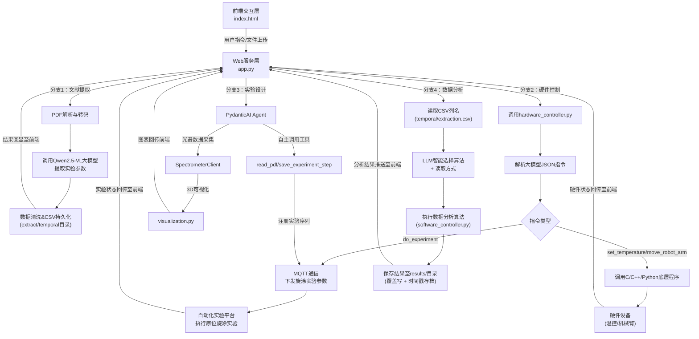

# SDL_agent：AI驱动的实验室自动化智能中枢

<div align="center">
  
  
  
</div>
<br>

SDL_agent 是一套集**学术文献PDF数据智能提取**、**AI算法自动生成**、**实验设计规划**、**自动化硬件控制**于一体的智能代理系统，实现"文献数据提取→AI生成算法→实验设计→自动化硬件执行→数据分析"的全流程闭环，适用于材料科学、化学等领域的实验室自动化场景。

<div align="center">
  
  <br>
  <p><i>图: 流程图</i></p>
</div>

---

## 一、系统整体流程

### 1. 核心流程概述


```mermaid
flowchart TD
    A["前端交互层<br/>index.html"] -->|用户指令/文件上传| B["Web服务层<br/>app.py"]

    %% 文献提取分支
    B -->|分支1：文献提取| C["PDF解析与转码"]
    C --> D["调用Qwen2.5-VL大模型<br/>提取实验参数"]
    D --> E["数据清洗&CSV持久化<br/>(extract/temporal目录)"]
    E -->|结果回显至前端| B

    %% 硬件控制分支
    B -->|分支2：硬件控制| F["调用hardware_controller.py"]
    F --> G["解析大模型JSON指令"]
    G --> H{"指令类型"}

    %% 指令类型分支
    H -->|do_experiment| I["MQTT通信<br/>下发旋涂实验参数"]
    I --> K["自动化实验平台<br/>执行原位旋涂实验"]
    K -->|实验状态回传至前端| B

    H -->|set_temperature/move_robot_arm| J["调用C/C++/Python底层程序"]
    J --> L["硬件设备<br/>(温控/机械臂)"]
    L -->|硬件状态回传至前端| B

    %% 实验设计Agent分支
    B -->|分支3：实验设计| M["PydanticAI Agent"]
    M -->|自主调用工具| N["read_pdf/save_experiment_step"]
    N -->|注册实验序列| I
    M -->|光谱数据采集| O["SpectrometerClient"]
    O -->|3D可视化| P["visualization.py"]
    P -->|图表回传前端| B

    %% 数据分析分支
    B -->|分支4：数据分析| Q["读取CSV列名<br/>(temporal/extraction.csv)"]
    Q --> R["LLM智能选择算法<br/>+ 读取方式"]
    R --> S["执行数据分析算法<br/>(software_controller.py)"]
    S --> T["保存结果至results/目录<br/>(覆盖写 + 时间戳存档)"]
    T -->|分析结果推送至前端| B
```

### 2. 流程拆解

#### （1）前端交互（index.html）

用户通过可视化Web界面操作，支持**5种核心模式**：

- **普通问答模式**：基础对话交互，支持流式输出与中断生成；
- **文献提取模式**：上传/选择PDF文献，输入提取任务描述（如"提取旋涂转速、试剂体积"），支持任务中断；
- **硬件操控模式**：下发硬件控制指令（如"执行原位旋涂实验，转速3000rpm"），执行期间不可中断；
- **实验设计模式**：AI自主读取文献并规划多步实验流程，支持可视化编辑和JSON导出；
- **数据分析模式**：LLM智能选择算法并执行分析，结果可视化展示。

界面支持PDF预览、算法面板、实验设计画布、进度实时展示、任务中断等能力。


<div align="center">
  
  <br>
  <p><i>图: 准备提取目标页面</i></p>
</div>

#### （2）文献数据提取

1. **PDF预处理**：将PDF指定页码转为高分辨率Base64图片，供大模型视觉输入；
2. **动态字段生成**：根据用户提取任务描述，调用大模型生成CSV表格列名（如"反溶剂名称""旋涂转速"）；
3. **大模型提取**：调用多模态模型，从PDF图片中提取目标实验参数；
4. **会话管理**：每次启动app.py创建时间戳会话文件夹`dialogue data/YYYYMMDD_HHMMSS/`，所有数据归档到会话目录；
5. **数据持久化**：提取结果写入`{session}/extract/前缀_时间戳.csv`（归档）和`{session}/temporal/extraction.csv`（临时文件）；
6. **进度回显**：实时向前端推送处理进度、提取结果、错误信息，支持任务手动中断。

<div align="center">
  
  <br>
  <p><i>图: 准备提取目标页面</i></p>
</div>


#### （3）硬件控制

1. **指令解析**：接收大模型输出的JSON格式指令，清洗并解析`action`（操作类型）和`params`（参数）；
2. **路由分发**：
   - `do_experiment`：解析旋涂实验参数（转速、加速度、时长、试剂、体积），读取试剂位置配置文件，通过MQTT协议（EMQX服务器）向自动化平台下发实验指令；
   - `set_temperature`：调用C/C++可执行文件控制温控设备；
   - `move_robot_arm`：调用Python脚本控制机械臂；
3. **通信保障**：MQTT连接带超时机制，断连自动重连，确保指令可靠下发。

#### （4）实验设计智能体

**设计阶段**（基于ExperimentDesignParser）：
1. **AI生成JSON**：用户输入"实验设计：<描述>"，LLM生成标准JSON实验计划；
2. **格式转换**：`ExperimentManager.json_to_visual()`将JSON转为前端可视化格式（节点+边）；
3. **可视化编辑**：前端画布支持拖拽节点、编辑参数、调整执行顺序；
4. **双向同步**：`visual_to_json()`将前端修改转回标准JSON格式。

**执行阶段**（基于ExperimentManager）：
1. **计划验证**：检查JSON结构、参数完整性、试剂可用性；
2. **拓扑排序**：根据节点依赖关系确定执行顺序；
3. **顺序执行**：逐步调用硬件工具（spin_coating、set_temperature等）；
4. **进度推送**：通过SSE实时推送执行状态到前端。

**为何分离设计与执行**：原PydanticAI方案依赖Function Calling（部分模型不支持），分离后任意LLM均可设计实验，用户可审查编辑后再执行。

<div align="center">
  
  <br>
  <p><i>图: 准备提取目标页面</i></p>
</div>

#### （5）数据分析模式

1. **CSV列名读取**：自动读取`{session}/temporal/extraction.csv`的列名列表；
2. **智能算法选择**：调用LLM分析列名，从可用算法列表中选择最适合的算法和读取方式；
3. **动态数据读取**：LLM指定读取函数（如`read_spectrum_format`或`read_numeric_columns`），Python通过`READER_REGISTRY`动态调用；
4. **算法执行**：调用`software_controller.py`执行选定算法，支持`data_statistics`、`data_normalization`、`spectrum_analysis`等；
5. **结果保存**：完整结果保存至`{session}/results/`目录，采用覆盖写（`analysis_{algorithm}.json`）+ 时间戳存档（`analysis_{algorithm}_{timestamp}.json`）模式；
6. **结果推送**：通过SSE向前端推送分析进度、结果摘要和文件路径，前端渲染蓝色结果卡片。

#### （6）AI算法生成（新功能）

1. **自然语言描述**：用户在算法面板输入算法需求（如"计算光谱峰值波长"）；
2. **规格提取**：`prompt_template.py`调用LLM提取算法规格（输入/输出/逻辑）；
3. **代码生成**：LLM生成完整Python代码，继承`BaseAlgorithm`基类；
4. **自动保存**：代码保存到`software/algorithms/extra_algorithms_fromProjects/`；
5. **热加载**：`software_controller.py`自动重新扫描算法目录，新算法立即可用；
6. **前端集成**：算法面板实时更新，用户可直接调用新生成的算法。


#### （7）中断机制

| 场景 | 是否可中断 | 实现方式 |
|------|-----------|---------|
| 普通对话 | 可中断 | 前端 AbortController 终止流式响应 |
| 文献提取 | 可中断 | 后端协作式取消标志，逐页检查 |
| 硬件执行 | 不可中断 | 执行期间按钮锁定，拒绝取消请求 |

---

## 二、项目结构

```
SDL_agent/
├── app.py                      # Flask Web服务入口，路由与请求处理
├── config.txt                  # API配置文件（API_KEY、API_URL、MODEL_NAME等）
├── core/                       # 核心业务逻辑模块
│   ├── config.py               # 全局配置类（读取config.txt）
│   ├── llm_client.py           # LLM API封装（流式/非流式调用）
│   ├── pdf_processor.py        # PDF解析与图像转换
│   ├── field_inference.py      # 动态字段推断、算法解析、实验设计提示词
│   ├── extraction_engine.py    # 提取引擎核心（PDF遍历、LLM交互、结果汇总）
│   ├── task_manager.py         # 任务队列管理（进度推送、取消控制）
│   ├── hardware_controller.py  # 硬件控制智能体（指令解析、工具调用）
│   ├── experiment_agent.py     # 实验设计智能体（PydanticAI，legacy模式）
│   ├── experiment_manager.py   # 实验执行、验证、JSON↔visual格式转换
│   ├── software_manager.py     # 软件算法管理器（桥接software模块）
│   └── csv_writer.py           # CSV文件读写与合并
├── hardware/                   # 硬件通信层
│   ├── agent_client.py         # MQTT连接器（EMQX客户端）
│   ├── tools.py                # 底层硬件函数（MQTT发布、子进程调用）
│   ├── spec_client.py          # 光谱仪数据采集客户端
│   └── visualization.py        # 光谱数据3D可视化模块
├── software/                   # 纯软件算法与数据处理模块
│   ├── software_controller.py  # 算法注册表与统一调用入口
│   ├── readfile.py             # CSV读取工具（LLM动态调用接口）
│   ├── auto_analyze.py         # 自动分析流水线（LLM选算法 + 执行）
│   └── algorithms/             # 算法实现目录
│       ├── base.py             # BaseAlgorithm基类
│       ├── default/            # 内置算法（data_statistics等）
│       └── extra_algorithms_fromProjects/  # AI生成算法 + prompt_template.py
├── templates/
│   └── index.html              # 前端可视化界面（算法面板、实验设计画布）
├── dialogue data/              # 会话数据目录（每次启动创建时间戳文件夹）
│   └── YYYYMMDD_HHMMSS/        # 单次会话目录
│       ├── extract/            # 归档提取结果（带时间戳CSV）
│       ├── temporal/           # 临时工作文件（extraction.csv）
│       ├── results/            # 分析结果（JSON格式）
│       └── experiment_designs/ # 实验设计JSON文件
├── pdf_cache/                  # 实验设计模式PDF临时缓存
├── figures/                    # README插图 + 光谱可视化图表输出
├── reagent_layout.json         # 试剂位置配置文件
└── requirements.txt            # Python依赖
```

---

## 三、核心文件说明

| 文件路径 | 核心角色 | 关键能力 |
|----------|----------|----------|
| `app.py` | Flask Web服务主程序 | 路由分发、会话管理、任务调度、实验设计集成 |
| `config.txt` | 配置文件 | API_KEY、API_URL、MODEL_NAME_VL、MODEL_NAME_TALK |
| `core/config.py` | 配置类 | 读取config.txt、提供全局配置访问接口 |
| `core/field_inference.py` | 字段推断与解析 | 动态CSV列名生成、算法解析、ExperimentDesignParser |
| `core/experiment_manager.py` | 实验管理器 | 实验执行、验证、JSON↔visual格式转换 |
| `core/extraction_engine.py` | 提取引擎 | 逐页提取、会话路径管理、结果解析 |
| `core/software_manager.py` | 算法管理器 | 算法注册、generate_algorithm()、热加载 |
| `hardware/tools.py` | 硬件执行层 | MQTT发布实验指令、温控/机械臂调用 |
| `software/algorithms/ extra_algorithms_fromProjects/ prompt_template.py` | 算法生成器 | LLM生成算法代码、规格提取 |
| `templates/index.html` | 前端界面 | 算法面板、实验设计画布、PDF预览、进度展示 |
| `dialogue data/{timestamp}/` | 会话目录 | 单次运行的所有数据（extract/temporal/results/experiment_designs） |

---

## 四、环境配置

### 1. 配置虚拟环境

```bash
conda create -n SDL_agent python=3.10 -y
conda activate SDL_agent
```

### 2. 依赖安装

```bash
pip install -r requirements.txt
# flask==2.3.3
# pymupdf==1.23.22
# pillow==10.1.0
# requests==2.31.0
# paho-mqtt==1.6.1
# python-dotenv==1.0.0
# pydantic-ai>=0.0.1
# matplotlib>=3.5.0
# numpy>=1.21.0
# pandas>=1.3.0
```

### 3. 关键配置项

**方式一：修改 `config.txt`（推荐）**

在项目根目录创建或编辑 `config.txt`：

```ini
API_KEY=你的API密钥
API_URL=https://api.siliconflow.cn/v1/chat/completions
MODEL_NAME_VL=Qwen/Qwen2.5-VL-72B-Instruct
MODEL_NAME_TALK=Qwen/Qwen2.5-72B-Instruct
PDF_FOLDER=D:/your/pdf/folder
```

**方式二：修改 `core/config.py`（备选）**

如果未提供 `config.txt`，系统会使用 `config.py` 中的默认值：

```python
# 大模型API配置
API_KEY = "你的API密钥"
MODEL_NAME_VL = "Qwen/Qwen2.5-VL-72B-Instruct"
MODEL_NAME_TALK = "Qwen/Qwen2.5-72B-Instruct"
API_URL = "https://api.siliconflow.cn/v1/chat/completions"

# PDF存储目录
PDF_FOLDER = "本地PDF文件夹路径"
```

**MQTT配置**（用于硬件控制）：

修改 `hardware/agent_client.py`：

```python
class Client_Conf:
    def __init__(self):
        self.client_id = "自定义客户端ID"
        self.usr_name = "MQTT账号"
        self.password = "MQTT密码"
        self.ip = "MQTT服务器IP"
        self.port = 1883
```

---

## 五、快速启动

1. **配置API密钥**：编辑根目录 `config.txt`，设置 `API_KEY` 和其他必要参数；
2. **启动Flask服务**：
   ```bash
   python app.py
   ```
3. 浏览器自动打开或手动访问 `http://127.0.0.1:5000`；
4. **选择模式使用**：
   - **文献提取**：输入"帮我搜寻：提取FAPbI3钝化剂参数"；
   - **硬件控制**：输入"硬件控制：执行旋涂实验，转速3000rpm"；
   - **实验设计**：输入"实验设计：设计三步旋涂实验"，AI生成JSON计划并可视化；
   - **数据分析**：输入"数据分析"，LLM自动选择算法并执行；
   - **算法生成**：打开算法面板，输入"生成计算光谱峰值的算法"。

<div align="center">
  <p><i>💡 请在此处放置快速启动演示GIF</i></p>
  <p><i>建议内容：从启动app.py到完成一次文献提取的完整流程动图</i></p>
</div>

---

## 六、界面预览

<div align="center">
  
  <br>
  <p><i>图: 初始界面</i></p>
</div>

<div align="center">
  
  <br>
  <p><i>图: 准备提取目标页面</i></p>
</div>

<div align="center">
  
  <br>
  <p><i>图: 提取中的页面</i></p>
</div>

### 界面效果说明

- 左侧/顶部：系统状态与模式切换区；
- 中间：对话/提取结果展示区，支持实验参数提取结果卡片化展示；
- 底部：输入区，支持文件上传、模式选择、指令输入；
- 分屏模式：可展开PDF预览面板，实时查看AI正在处理的文献页面。

---

## 七、核心特性

1. **多模态数据提取**：基于视觉大模型，从PDF图片中精准提取结构化实验参数；
2. **动态字段适配**：根据用户任务描述自动生成CSV列名，无需固定模板；
3. **会话管理**：每次启动创建时间戳会话文件夹，所有数据归档到独立目录；
4. **AI算法生成**：自然语言描述算法需求，LLM自动生成Python代码并热加载；
5. **实验设计可视化**：AI生成JSON实验计划，前端画布支持拖拽编辑和执行；
6. **硬件控制闭环**：提取的实验参数可直接驱动自动化实验平台执行；
7. **智能数据分析**：LLM自动读取CSV列名，智能选择算法并执行分析；
8. **可视化交互**：全流程Web界面操作，支持PDF预览、算法面板、实验设计画布；
9. **灵活中断控制**：对话与提取任务支持随时中断，硬件执行期间自动锁定防止误操作；
10. **高可靠性**：MQTT通信带超时重连，任务支持手动中断，异常自动捕获。


---

## 八、扩展指南

### 1. 添加新的数据分析算法

**第一步**：在 `software/algorithms/default/` 下创建新算法文件

```python
from software.algorithms.base import BaseAlgorithm
import pandas as pd

class MyNewAlgorithm(BaseAlgorithm):
    """你的算法描述"""
    
    def run(self, data: pd.DataFrame) -> dict:
        """
        执行算法逻辑
        
        Args:
            data: 输入数据
            
        Returns:
            分析结果字典
        """
        # 你的算法逻辑
        result = {"summary": "分析结果"}
        return result
```

**第二步**：重启Flask应用，算法自动注册到系统

**第三步**：在前端算法面板或通过"数据分析"模式调用新算法

> **提示**：也可以通过AI算法生成功能，用自然语言描述需求，让LLM自动生成算法代码。

---

### 2. 添加新硬件设备

以添加"超声波清洗机"为例：

**第一步**：在 `hardware/tools.py` 中添加执行函数

```python
def execute_ultrasonic_clean(frequency: int, duration: int, power: int) -> str:
    """执行超声波清洗"""
    payload = f"ultrasonic,{frequency},{duration},{power}"
    local_client.publish("ultrasonic_clean", payload)
    return f"超声波清洗已启动: {frequency}kHz, {duration}s, {power}W"
```

**第二步**：在 `core/hardware_controller.py` 的 `_load_hardware_tools()` 中注册

```python
HardwareTool(
    name="ultrasonic_clean",
    description="执行超声波清洗",
    params={
        "frequency": {"type": "int", "description": "清洗频率(kHz)", "required": True},
        "duration": {"type": "int", "description": "持续时间(秒)", "required": True},
        "power": {"type": "int", "description": "功率(W)", "required": False, "default": 100}
    },
    function="execute_ultrasonic_clean"
)
```

**第三步**：在 `execute_tool_call()` 中添加分发逻辑

```python
elif tool_name == "ultrasonic_clean":
    result = execute_ultrasonic_clean(
        int(params["frequency"]),
        int(params["duration"]),
        int(params.get("power", 100))
    )
```

> **注册完成后**，LLM会自动识别新硬件工具，用户输入"执行超声波清洗，40kHz，5分钟"时自动调用。

---

### 3. 自定义实验设计模板

修改 `core/field_inference.py` 中的 `ExperimentDesignParser.EXPERIMENT_AGENT_SYSTEM_PROMPT`：

```python
EXPERIMENT_AGENT_SYSTEM_PROMPT = """
You are an experienced materials scientist.
Design experiments in JSON format with the following structure:
{
  "experiment_name": "实验名称",
  "steps": [
    {"type": "tool", "name": "spin_coating", "params": {...}, "description": "..."},
    {"type": "helper", "name": "WAIT", "params": {"duration": 5000}, "description": "..."}
  ]
}
Available tools: spin_coating, set_temperature, move_robot_arm, collect_spectrum
"""
```

重启应用后，AI会按照新提示词生成实验计划。

---

## 九、注意事项

1. **API配置**：首次运行前必须在 `config.txt` 中设置 `API_KEY`，否则所有LLM调用失败；
2. **会话数据**：每次启动app.py创建新会话文件夹，旧会话数据保留在 `dialogue data/` 下，可手动清理；
3. **MQTT连接**：硬件功能需MQTT服务器（EMQX）正常运行，否则硬件控制功能不可用；
4. **端口占用**：Flask默认绑定5000端口，确保端口未被占用；
5. **硬件执行不可中断**：硬件操作启动后无法取消，执行期间界面自动锁定；
6. **试剂配置**：`reagent_layout.json` 需与实际硬件平台试剂摆放一致；
7. **算法热加载**：AI生成的算法自动保存到 `extra_algorithms_fromProjects/`，无需重启即可使用；
8. **Python版本**：建议使用Python 3.10+，避免依赖兼容问题；
9. **文件路径**：Windows环境下使用正斜杠 `/` 或双反斜杠 `\\`，避免路径解析错误；
10. **代码修改**：修改后端代码后需重启Flask应用，前端HTML修改刷新浏览器即可。

---

## 十、常见问题

**Q1: 启动后提示"API_KEY未配置"？**  
A: 在项目根目录创建 `config.txt`，添加 `API_KEY=你的密钥`。

**Q2: 文献提取失败，提示"PDF文件未找到"？**  
A: 检查 `config.txt` 中的 `PDF_FOLDER` 路径是否正确，确保PDF文件存在。

**Q3: 硬件控制无响应？**  
A: 检查MQTT服务器是否运行，`hardware/agent_client.py` 中的IP和端口是否正确。

**Q4: 如何查看会话历史数据？**  
A: 进入 `dialogue data/` 目录，每个时间戳文件夹对应一次会话，包含extract/temporal/results子目录。

**Q5: AI生成的算法在哪里？**  
A: 保存在 `software/algorithms/extra_algorithms_fromProjects/`，文件名为算法名称。

**Q6: 如何清理旧会话数据？**  
A: 手动删除 `dialogue data/` 下的旧时间戳文件夹即可。

---

## 十一、技术栈

- **后端框架**：Flask 2.3.3
- **PDF处理**：PyMuPDF (fitz)
- **LLM交互**：OpenAI API兼容接口（支持Qwen、GPT等）
- **硬件通信**：MQTT (paho-mqtt)
- **实验设计**：PydanticAI (legacy模式) + 自定义JSON解析器
- **数据分析**：Pandas、NumPy、Matplotlib
- **前端**：原生HTML/CSS/JavaScript + Canvas API

---

## 十二、贡献指南

欢迎提交Issue和Pull Request！

1. Fork本仓库
2. 创建特性分支 (`git checkout -b feature/AmazingFeature`)
3. 提交更改 (`git commit -m 'Add some AmazingFeature'`)
4. 推送到分支 (`git push origin feature/AmazingFeature`)
5. 开启Pull Request

---

## 十四、致谢

