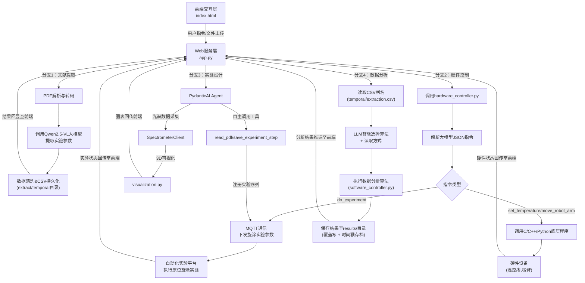
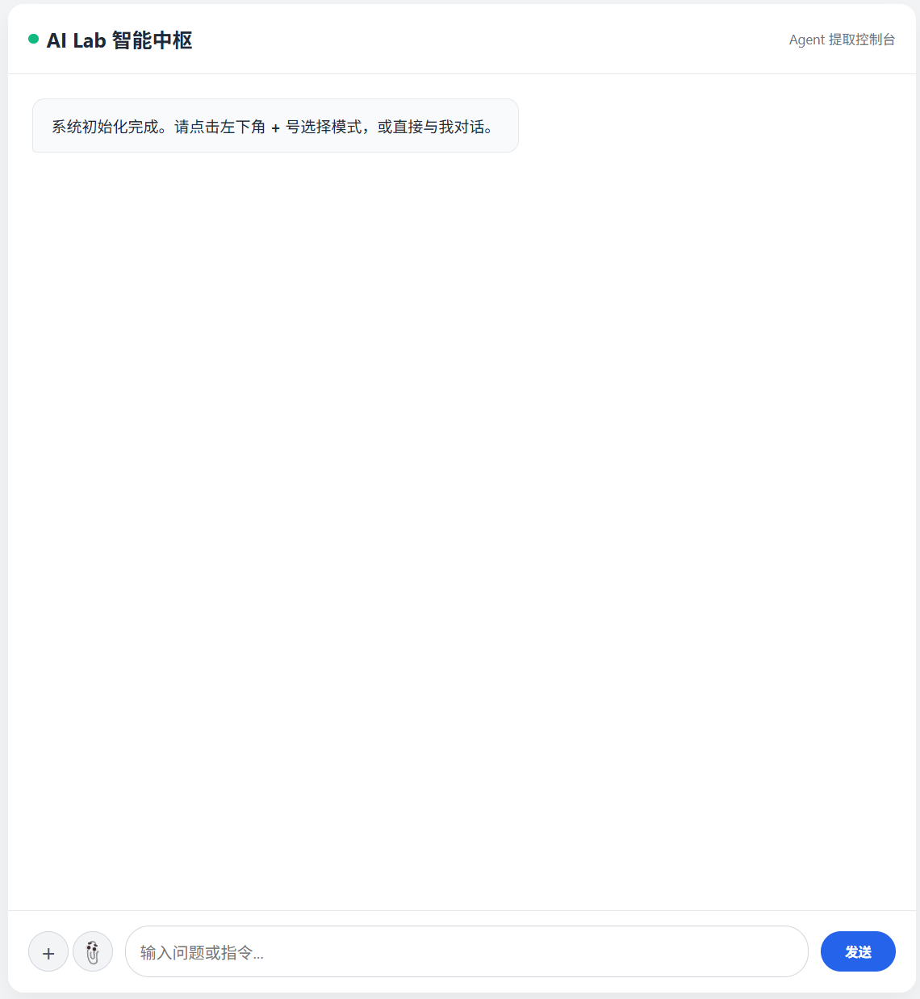
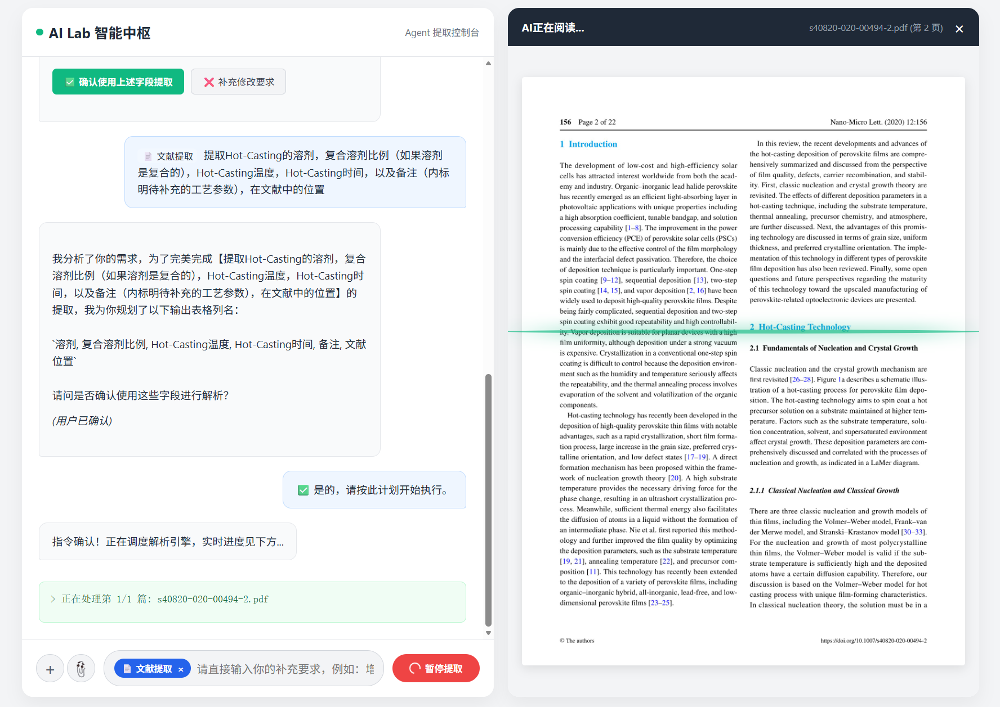
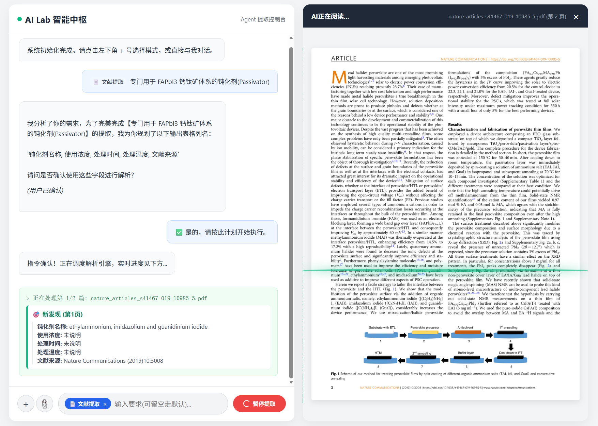

# SDL_agent：AI驱动的文献提取与硬件控制智能中枢

SDL_agent 是一套集**学术文献PDF数据智能提取**、**大模型指令解析**、**自动化硬件控制**于一体的智能代理系统，核心为"文献数据提取→实验参数解析→自动化硬件执行"的全流程闭环，适用于实验室自动化实验场景（如原位旋涂实验）。

---

## 一、系统整体流程

### 1. 核心流程概述


```mermaid
flowchart TD
    A["前端交互层<br/>index.html"] -->|用户指令/文件上传| B["Web服务层<br/>app.py"]

    %% 文献提取分支
    B -->|分支1：文献提取| C["PDF解析与转码"]
    C --> D["调用Qwen2.5-VL大模型<br/>提取实验参数"]
    D --> E["数据清洗&CSV持久化<br/>(extract/temporal目录)"]
    E -->|结果回显至前端| B

    %% 硬件控制分支
    B -->|分支2：硬件控制| F["调用hardware_controller.py"]
    F --> G["解析大模型JSON指令"]
    G --> H{"指令类型"}

    %% 指令类型分支
    H -->|do_experiment| I["MQTT通信<br/>下发旋涂实验参数"]
    I --> K["自动化实验平台<br/>执行原位旋涂实验"]
    K -->|实验状态回传至前端| B

    H -->|set_temperature/move_robot_arm| J["调用C/C++/Python底层程序"]
    J --> L["硬件设备<br/>(温控/机械臂)"]
    L -->|硬件状态回传至前端| B

    %% 实验设计Agent分支
    B -->|分支3：实验设计| M["PydanticAI Agent"]
    M -->|自主调用工具| N["read_pdf/save_experiment_step"]
    N -->|注册实验序列| I
    M -->|光谱数据采集| O["SpectrometerClient"]
    O -->|3D可视化| P["visualization.py"]
    P -->|图表回传前端| B

    %% 数据分析分支
    B -->|分支4：数据分析| Q["读取CSV列名<br/>(temporal/extraction.csv)"]
    Q --> R["LLM智能选择算法<br/>+ 读取方式"]
    R --> S["执行数据分析算法<br/>(software_controller.py)"]
    S --> T["保存结果至results/目录<br/>(覆盖写 + 时间戳存档)"]
    T -->|分析结果推送至前端| B
```


### 2. 流程拆解

#### （1）前端交互（index.html）

用户通过可视化Web界面操作，支持4种核心模式：

- **普通问答模式**：基础对话交互，支持流式输出与中断生成；
- **文献提取模式**：上传/选择PDF文献，输入提取任务描述（如"提取旋涂转速、试剂体积"），支持任务中断；
- **硬件操控模式**：下发硬件控制指令（如"执行原位旋涂实验，转速3000rpm"），执行期间不可中断；
- **实验设计模式**：上传文献后，AI自主读取并规划多步实验流程，支持光谱数据实时采集与可视化；
- **数据分析模式**：自动分析CSV数据，LLM智能选择算法并执行分析，结果可视化展示。

界面支持PDF预览、提取进度实时展示、任务中断、结果可视化等能力。

#### （2）文献数据提取

1. **PDF预处理**：将PDF指定页码转为高分辨率Base64图片，供大模型视觉输入；
2. **动态字段生成**：根据用户提取任务描述，调用Qwen2.5-72B大模型生成CSV表格列名（如"反溶剂名称""旋涂转速"）；
3. **大模型提取**：调用Qwen2.5-VL-72B-Instruct多模态模型，从PDF图片中提取目标实验参数；
4. **数据持久化**：将提取结果写入CSV文件（分归档文件`extract/前缀_时间戳.csv`和临时文件`temporal/extraction.csv`，后者供硬件控制模块调用）；
5. **进度回显**：实时向前端推送处理进度、提取结果、错误信息，支持任务手动中断。

#### （3）硬件控制

1. **指令解析**：接收大模型输出的JSON格式指令，清洗并解析`action`（操作类型）和`params`（参数）；
2. **路由分发**：
   - `do_experiment`：解析旋涂实验参数（转速、加速度、时长、试剂、体积），读取试剂位置配置文件，通过MQTT协议（EMQX服务器）向自动化平台下发实验指令；
   - `set_temperature`：调用C/C++可执行文件控制温控设备；
   - `move_robot_arm`：调用Python脚本控制机械臂；
3. **通信保障**：MQTT连接带超时机制，断连自动重连，确保指令可靠下发。

#### （4）实验设计智能体（PydanticAI）

基于PydanticAI原生tool-use架构，AI自主选择工具并规划实验流程：

1. **工具注册**：`read_pdf`、`save_experiment_step`、`start_experiment`、`get_all_reagents`；
2. **自主决策**：AI根据用户意图和工具docstring，自主决定调用顺序和参数；
3. **多步实验**：先读论文提取参数→注册多步旋涂实验→启动执行序列；
4. **光谱采集**：`SpectrometerClient`通过MQTT订阅光谱仪实时数据，汇总为DataFrame；
5. **3D可视化**：`visualization.py`将光谱数据绘制为曲面图，支持文件保存或base64输出。

#### （5）数据分析模式

	1. **CSV列名读取**：自动读取`temporal/extraction.csv`的列名列表；
	2. **智能算法选择**：调用LLM分析列名，从可用算法列表中选择最适合的算法和读取方式；
	3. **动态数据读取**：LLM指定读取函数（如`read_spectrum_format`或`read_numeric_columns`），Python通过`READER_REGISTRY`动态调用；
	4. **算法执行**：调用`software_controller.py`执行选定算法，支持`data_statistics`、`data_normalization`、`spectrum_analysis`等；
	5. **结果保存**：完整结果保存至`results/`目录，采用覆盖写（`analysis_{algorithm}.json`）+ 时间戳存档（`analysis_{algorithm}_{timestamp}.json`）模式；
	6. **结果推送**：通过SSE向前端推送分析进度、结果摘要和文件路径，前端渲染蓝色结果卡片。
	
	#### （6）中断机制

| 场景 | 是否可中断 | 实现方式 |
|------|-----------|---------|
| 普通对话 | 可中断 | 前端 AbortController 终止流式响应 |
| 文献提取 | 可中断 | 后端协作式取消标志，逐页检查 |
| 硬件执行 | 不可中断 | 执行期间按钮锁定，拒绝取消请求 |

---

## 二、项目结构

```
SDL_agent/
├── app.py                      # Flask Web服务入口，路由与请求处理
├── core/                       # 核心业务逻辑模块
│   ├── __init__.py             # 模块导出注册
│   ├── config.py               # 全局配置（API密钥、模型、路径、光谱仪MQTT等）
│   ├── llm_client.py           # LLM API封装（流式/非流式调用）
│   ├── pdf_processor.py        # PDF解析与图像转换
│   ├── field_inference.py      # 动态字段推断与Pydantic模型生成
│   ├── extraction_engine.py    # 提取引擎核心（PDF遍历、LLM交互、结果汇总）
│   ├── task_manager.py         # 任务队列管理（进度推送、取消控制）
│   ├── hardware_controller.py  # 硬件控制智能体（指令解析、工具调用）
│   ├── experiment_agent.py     # 实验设计智能体（PydanticAI原生tool-use）
│   ├── software_manager.py     # 软件算法管理器（桥接software模块）
│   └── csv_writer.py           # CSV文件读写与合并
├── hardware/                   # 硬件通信层
│   ├── __init__.py             # 硬件模块导出
│   ├── agent_client.py         # MQTT连接器（EMQX客户端）
│   ├── tools.py                # 底层硬件函数（MQTT发布、子进程调用、PydanticAI工具）
│   ├── spec_client.py          # 光谱仪数据采集客户端
│   └── visualization.py        # 光谱数据3D可视化模块
├── software/                   # 纯软件算法与数据处理模块
│   ├── __init__.py             # 包入口
│   ├── software_controller.py  # 算法注册表与统一调用入口
│   ├── readfile.py             # CSV读取工具（LLM动态调用接口）
│   ├── auto_analyze.py         # 自动分析流水线（LLM选算法 + 执行）
│   └── algorithms/             # 算法实现目录
│       ├── base.py             # BaseAlgorithm基类
│       ├── default/            # 内置算法
│       └── extra_algorithms_fromProjects/  # 扩展算法
├── templates/
│   └── index.html              # 前端可视化界面
├── pdf_cache/                  # 实验设计模式PDF临时缓存
├── extract/                    # 归档数据目录（按时间戳存储历史提取结果）
├── temporal/                   # 临时数据目录（extraction.csv供硬件模块调用）
├── results/                    # 分析结果目录（JSON格式，覆盖写+时间戳存档）
├── figures/                    # README插图 + 光谱可视化图表输出
├── reagent_layout.json         # 试剂位置配置文件
└── requirements.txt            # Python依赖
```

---

## 三、核心文件说明

| 文件路径 | 核心角色 | 关键能力 |
|----------|----------|----------|
| `app.py` | Flask Web服务主程序 | 路由分发、请求处理、任务调度、实验设计Agent集成 |
| `core/config.py` | 全局配置 | API密钥、模型名称、PDF路径、光谱仪MQTT、实验Agent提示词 |
| `core/llm_client.py` | LLM客户端 | 流式/非流式API调用、JSON校验、Pydantic验证 |
| `core/pdf_processor.py` | PDF处理器 | PDF转Base64图片、文件列表、页面信息 |
| `core/field_inference.py` | 字段推断 | 动态CSV列名生成、Pydantic模型构建 |
| `core/extraction_engine.py` | 提取引擎 | 逐页提取、LLM视觉API调用、结果解析 |
| `core/task_manager.py` | 任务管理 | SSE消息队列、任务生命周期、取消控制 |
| `core/hardware_controller.py` | 硬件控制器 | LLM指令解析、工具路由、参数验证、执行状态 |
| `core/experiment_agent.py` | 实验设计Agent | PydanticAI原生tool-use、多步实验规划、会话管理 |
| `core/software_manager.py` | 软件算法管理器 | 桥接app.py与software模块、提供CSV分析快捷接口 |
| `core/csv_writer.py` | CSV写入器 | 写入、追加、合并、验证CSV文件 |
| `hardware/tools.py` | 硬件执行层 | MQTT发布实验指令、温控/机械臂调用、PydanticAI异步工具 |
| `hardware/agent_client.py` | MQTT连接器 | EMQX服务器连接、断连重连 |
| `hardware/spec_client.py` | 光谱仪客户端 | MQTT订阅光谱数据、状态机控制、DataFrame汇总 |
| `hardware/visualization.py` | 3D可视化 | 光谱数据曲面图绘制、文件保存/base64输出 |
| `templates/index.html` | 前端界面 | 多模式交互、PDF预览、进度展示、任务中断控制 |
| `temporal/extraction.csv` | 临时数据 | 最新提取结果，供硬件模块读取 |
| `reagent_layout.json` | 试剂配置 | 自动化平台试剂物理位置（BPxx格式） |

---

## 四、环境配置

### 1. 配置虚拟环境

```bash
conda create -n SDL_agent python=3.10 -y
conda activate SDL_agent
```

### 2. 依赖安装

```bash
pip install -r requirements.txt
# flask==2.3.3
# pymupdf==1.23.22
# pillow==10.1.0
# requests==2.31.0
# paho-mqtt==1.6.1
# python-dotenv==1.0.0
# pydantic-ai>=0.0.1
# matplotlib>=3.5.0
# numpy>=1.21.0
# pandas>=1.3.0
```

### 3. 关键配置项

修改 `core/config.py` 中以下配置适配本地环境：

```python
# 大模型API配置
API_KEY = "你的API密钥"
MODEL_NAME_VL = "Qwen/Qwen2.5-VL-72B-Instruct"
MODEL_NAME_TALK = "Qwen/Qwen2.5-7B-Instruct"
API_URL = "https://api.siliconflow.cn/v1/chat/completions"

# PDF存储目录
PDF_FOLDER = "本地PDF文件夹路径"

# 光谱仪MQTT配置（连接光谱仪数据采集端）
SPECTROMETER_BROKER_IP = "192.168.120.129"
SPECTROMETER_BROKER_PORT = 1883
SPECTROMETER_USERNAME = "你的MQTT用户名"
SPECTROMETER_PASSWORD = "你的MQTT密码"

# 实验设计智能体系统提示词
EXPERIMENT_AGENT_SYSTEM_PROMPT = "You are an experienced materials scientist..."
```

修改 `hardware/agent_client.py` 中硬件控制MQTT配置：

```python
class Client_Conf:
    def __init__(self):
        self.client_id = "自定义客户端ID"
        self.usr_name = "MQTT账号"
        self.password = "MQTT密码"
        self.ip = "MQTT服务器IP"
        self.port = 1883
```

---

## 五、快速启动

1. 配置好API密钥、PDF目录、MQTT服务器信息；
2. 启动Flask服务：
   ```bash
   python app.py
   ```
3. 浏览器自动打开或手动访问 `http://127.0.0.1:5000`，进入"AI Lab 智能中枢"界面；
4. 选择模式使用：
   - **文献提取**：输入"帮我搜寻：提取FAPbI3钝化剂参数"；
   - **硬件控制**：输入"硬件控制：执行旋涂实验，转速3000rpm"；
   - **实验设计**：上传PDF后，与AI对话规划多步实验流程；
   - **数据分析**：输入"数据分析："（默认使用temporal/extraction.csv）或指定CSV路径。

---

## 六、界面预览

<div align="center">
  
  <br>
  <p><i>图: 初始界面</i></p>
</div>

<div align="center">
  
  <br>
  <p><i>图: 准备提取目标页面</i></p>
</div>

<div align="center">
  
  <br>
  <p><i>图: 提取中的页面</i></p>
</div>

### 界面效果说明

- 左侧/顶部：系统状态与模式切换区；
- 中间：对话/提取结果展示区，支持实验参数提取结果卡片化展示；
- 底部：输入区，支持文件上传、模式选择、指令输入；
- 分屏模式：可展开PDF预览面板，实时查看AI正在处理的文献页面。

---

## 七、核心特性

1. **多模态数据提取**：基于Qwen2.5-VL大模型，从PDF图片中精准提取结构化实验参数；
2. **动态字段适配**：根据用户任务描述自动生成CSV列名，无需固定模板；
3. **硬件控制闭环**：提取的实验参数可直接驱动自动化实验平台执行原位旋涂实验；
4. **实验设计Agent**：PydanticAI原生tool-use，AI自主读取文献、规划多步实验、启动执行；
5. **智能数据分析**：LLM自动读取CSV列名，智能选择算法并执行分析，结果可视化展示；
6. **光谱数据采集**：实时订阅光谱仪MQTT数据，3D曲面图可视化；
7. **可视化交互**：全流程Web界面操作，支持PDF预览、进度实时展示；
8. **灵活中断控制**：对话与提取任务支持随时中断，硬件执行期间自动锁定防止误操作；
9. **数据持久化**：提取结果分归档/临时文件存储，分析结果覆盖写+时间戳存档；
10. **高可靠性**：MQTT通信带超时重连，任务支持手动中断，异常自动捕获。

---

## 八、扩展指南

### 1. 在 `core/` 中添加软件功能模块（如算法、数据分析）

以添加一个"数据分析模块"为例：

**第一步**：在 `core/` 下新建模块文件 `core/data_analyzer.py`

```python
"""
数据分析模块 - 你的模块描述
"""
from .config import Config
from .llm_client import LLMClient  # 如需调用大模型


class DataAnalyzer:
    """数据分析器"""

    def __init__(self):
        self.config = Config()
        # 初始化你需要的资源

    def analyze(self, data):
        """核心分析方法"""
        # 你的算法逻辑
        return result
```

**第二步**：在 `core/__init__.py` 中注册导出

```python
from .data_analyzer import DataAnalyzer

__all__ = [
    # ... 已有的模块 ...
    'DataAnalyzer'
]
```

**第三步**：在 `app.py` 中实例化并添加路由

```python
from core import DataAnalyzer

data_analyzer = DataAnalyzer()

@app.route('/api/analyze', methods=['POST'])
def analyze():
    data = request.json
    result = data_analyzer.analyze(data)
    return jsonify(result)
```

**第四步**（可选）：在 `templates/index.html` 中添加对应的前端交互入口。

> **设计原则**：每个模块文件职责单一，通过 `Config` 读取配置，通过 `LLMClient` 调用大模型，通过 `TaskManager` 推送进度（如需异步任务）。

---

### 2. 在 `hardware/` 中添加新硬件设备

以添加一个"超声波清洗机"为例：

**第一步**：在 `hardware/tools.py` 中添加底层执行函数

```python
def execute_ultrasonic_clean(frequency: int, duration: int, power: int) -> str:
    """
    执行超声波清洗

    Args:
        frequency: 频率(kHz)
        duration: 持续时间(秒)
        power: 功率(W)

    Returns:
        执行结果字符串
    """
    # 方式一：通过MQTT下发指令
    payload = f"ultrasonic,{frequency},{duration},{power}"
    local_client.publish("ultrasonic_clean", payload)
    return f"超声波清洗已启动: {frequency}kHz, {duration}s, {power}W"

    # 方式二：通过子进程调用本地程序
    # import subprocess
    # subprocess.run(["./ultrasonic_controller", str(frequency), str(duration)])
    # return "超声波清洗已启动"
```

**第二步**：在 `core/hardware_controller.py` 的 `_load_hardware_tools()` 中注册新工具

```python
HardwareTool(
    name="ultrasonic_clean",
    description="执行超声波清洗",
    params={
        "frequency": {
            "type": "int",
            "description": "清洗频率(kHz)",
            "required": True,
            "default": 40
        },
        "duration": {
            "type": "int",
            "description": "持续时间(秒)",
            "required": True,
            "default": 300
        },
        "power": {
            "type": "int",
            "description": "功率(W)",
            "required": False,
            "default": 100
        }
    },
    function="execute_ultrasonic_clean"
)
```

**第三步**：在 `execute_tool_call()` 方法中添加分发逻辑

```python
elif tool_name == "ultrasonic_clean":
    result = execute_ultrasonic_clean(
        int(params["frequency"]),
        int(params["duration"]),
        int(params.get("power", 100))
    )
```

**第四步**：在 `hardware/tools.py` 的顶部 import 中确保新函数可被导入。

> **注册完成后**，大模型会自动识别新硬件工具——用户输入"执行超声波清洗，40kHz，5分钟"时，LLM会自动匹配到 `ultrasonic_clean` 工具并生成对应参数。

---

### 3. 为实验设计Agent添加新工具（PydanticAI）

以添加"查询实验历史"工具为例：

**第一步**：在 `hardware/tools.py` 中定义异步工具函数

```python
from pydantic_ai import Tool

@Tool
async def query_experiment_history(experiment_id: str) -> str:
    """
    查询指定实验的历史执行记录

    Args:
        experiment_id: 实验唯一标识符

    Returns:
        实验历史记录摘要
    """
    # 从数据库或文件中查询历史记录
    history = load_experiment_history(experiment_id)
    return f"实验 {experiment_id} 的历史记录: {history}"
```

**第二步**：在 `core/experiment_agent.py` 的 `_create_agent()` 中注册工具

```python
from hardware.tools import query_experiment_history

return Agent(
    model,
    system_prompt=self.config.EXPERIMENT_AGENT_SYSTEM_PROMPT,
    deps_type=Deps,
    tools=[read_pdf, save_experiment_step, start_experiment, get_all_reagents, query_experiment_history],
)
```

**第三步**：更新 `config.py` 中的系统提示词，告知AI有新工具可用

```python
EXPERIMENT_AGENT_SYSTEM_PROMPT: str = (
    "You are an experienced materials scientist. "
    "Available tools: read_pdf, save_experiment_step, start_experiment, get_all_reagents, query_experiment_history. "
    "..."
)
```

> **PydanticAI特点**：AI通过函数docstring理解工具功能，自主决定调用时机和参数，无需硬编码路由逻辑。

---

### 4. 添加新的光谱数据可视化功能

**第一步**：在 `hardware/visualization.py` 中添加新的绘图函数

```python
def save_heatmap(df: pd.DataFrame, output_path: str) -> str:
    """
    绘制光谱数据热力图

    Args:
        df: 包含 counts, wavelength, time 的 DataFrame
        output_path: 输出文件路径

    Returns:
        保存的文件路径
    """
    # 数据提取与热力图绘制逻辑
    ...
    return output_path
```

**第二步**：在 `hardware/spec_client.py` 的 `_run_loop()` 中调用新可视化函数

```python
if not self._df.empty:
    save_fig(self._df, output_dir=self.output_dir)
    save_heatmap(self._df, output_dir=self.output_dir)  # 新增热力图
```

---

## 九、注意事项

1. 确保MQTT服务器（EMQX）正常运行，自动化实验平台已接入对应Topic；
2. 大模型API调用需保证网络畅通，且API密钥有足够配额；
3. 硬件控制的C/C++可执行文件/Python脚本需放在项目根目录，确保路径正确；
4. 试剂位置配置文件 `reagent_layout.json` 需与自动化实验平台的试剂摆放一致；
5. 建议在Python 3.10+环境下运行，避免依赖兼容问题；
6. 硬件执行期间系统会锁定操作界面，请勿强制关闭浏览器以免指令丢失；
7. 光谱仪客户端需与光谱仪控制端配合使用，控制端需发送 `continue`/`record`/`stop` 命令；
8. PydanticAI Agent依赖异步运行环境，需确保 `asyncio` 事件循环正确初始化。